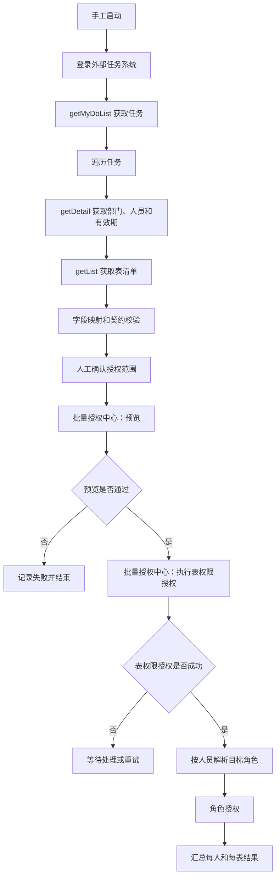

# 接口编排中心 PRD

状态：首版工程验证版 V0.3；P1 数据映射与画布连线编辑闭环已开发并在 128 验证，P1 剩余项及 P2-P4 尚未开发。

更新时间：2026-07-30

## 0. 当前实现状态

2026-07-30 已完成并发布到 `192.168.150.128` 的首版 MVP：

- HTTP 连接器的新增、编辑、删除、启停、测试和运行，支持无认证、Basic、API Key、Bearer 与 Raw Token。
- Header、Query、Body 模板、HTTP 成功状态和业务成功字段判断；动态 URL 不能改变已配置目标的协议与主机。
- Start、HTTP、Condition、SQL API、Mapping、End 画布节点，支持拖动、新增/选中/删除连线、无环校验、条件分支和已发布版本快照。
- 流程保存、发布、异步运行、逐节点结构化日志、运行详情和基于已发布版本的新运行重试。
- SQL 包装为 API，支持 Doris、MySQL、Oracle，使用参数绑定、输入 Schema、返回行数上限、启停、只读/写入权限隔离。
- 独立 `api_orchestration` Celery 队列和 `WORKER_SERVICE_MODE=api-orchestration` Worker。
- Mapping 节点的字段提取、重命名、嵌套/数组组合、原类型保持、缺失字段策略、逐节点日志和敏感值脱敏。
- 画布连线选中/删除、新增节点无重叠初始布局，以及运行列表和当前运行详情同步刷新。

当前尚未实现的内容必须继续按本 PRD 分期处理，不能因 MVP 页面已有入口而视为完成：

- 用户名密码登录换 Token 的认证配置、Token 缓存与受控失效刷新。
- 失败节点原位续跑；当前“重新执行”会基于发布快照创建新的运行记录并从开始节点执行。
- 可视化并行/汇聚、数组遍历、人工确认、业务键状态、业务能力适配器、补偿、定时、Webhook 和子流程。
- P3 的批量授权与角色授权正式节点，以及外部任务完整业务流程。
- 独立接口编排 API 容器的正式部署切换；当前 128 由 `monolith` API 提供接口，执行任务由独立 Worker 消费。

## 1. 背景

当前系统逐步接入多个外部系统，接口包括：

- 无状态接口：每次按固定契约请求即可。
- 认证有状态接口：需要先登录、缓存 Token，并在失效后受控刷新。
- 业务有状态接口：需要结合系统数据库、外部状态或前置接口结果判断。
- 长流程接口：多个接口顺序执行，并根据响应选择分支。
- 跨模块流程：外部数据需要交给批量授权、角色授权等既有模块处理。

如果每组接口都直接写入具体业务模块，会重复实现登录、映射、状态判断、重试、日志和 Mock，也容易把接口数据接入错误模块。因此需要独立、受控、可审计的接口编排能力。

## 2. 产品定位

新增独立业务模块“接口编排中心”，负责定义可复用接口连接器，并通过画布把连接器、判断、转换、状态和既有业务能力串成可执行流程。

编排中心不取代业务模块：

- 批量授权中心继续拥有部门映射、数据库用户、表权限授权和回收规则。
- 数据空间批量开通继续拥有用户、数据库和数据连接开通规则。
- 角色授权继续拥有角色、资源和删除语义。
- 编排中心只能通过已注册的“业务能力节点”调用这些模块，不能直接修改业务表或复制业务规则。

首版“支持任何接口”限定为常见 HTTP/HTTPS REST 接口，不等于允许任意协议、任意脚本和任意网络访问。SOAP、WebSocket、SSE、gRPC、FTP 等通过后续连接器类型扩展。

## 3. 外部参考

| 产品/思想 | 借鉴内容 | 本项目约束 |
|---|---|---|
| n8n | 连接器节点、表达式映射、逐节点记录、错误流程 | 不开放任意代码节点 |
| Node-RED | 消息流、节点上下文、流程上下文 | 加强持久化、版本冻结和审计 |
| Apache NiFi | 数据溯源、队列背压、处理器连接 | 补充业务状态机和人工确认 |
| Camunda/BPMN | 条件网关、人工任务、事件等待、事故处理 | 首版不实现完整 BPMN 语义 |
| Temporal | 持久化执行、故障恢复、活动重试 | 需评估独立运行时和部署成本 |
| Apache Camel EIP | 条件路由、拆分、聚合、幂等、Saga | 仍需本项目管理页面和权限治理 |
| Kestra | 声明式任务、触发器、版本化执行 | 需评估离线部署和现有系统集成 |

参考资料：

- https://docs.n8n.io/workflows/
- https://nodered.org/docs/user-guide/
- https://nifi.apache.org/docs/nifi-docs/html/user-guide.html
- https://docs.camunda.io/docs/components/concepts/processes/
- https://docs.temporal.io/workflows
- https://camel.apache.org/components/4.14.x/eips/enterprise-integration-patterns.html
- https://kestra.io/docs

本项目采用“受控连接器 + 声明式 DAG + 持久化节点状态 + 业务能力适配器”的组合思路。

## 4. 目标与非目标

目标：

1. 页面定义接口请求、响应、成功规则、重试和敏感字段。
2. 接口定义可复用、可修订、可发布和可测试。
3. 画布支持条件分支、并行、汇聚和受控遍历。
4. 支持无状态、Token 状态、执行状态、业务键状态和等待状态。
5. 流程级、节点级、请求级日志完整且脱敏。
6. Worker 或容器重启后可以恢复长流程。
7. 通过幂等键、重试边界和补偿避免重复授权或重复创建。
8. 外部数据必须明确映射，不根据相似字段名推断业务含义。

首版非目标：

- 任意 Python、JavaScript、Shell 节点。
- 任意非参数化写 SQL。
- 普通用户访问未登记的任意 URL/IP。
- 完整 BPMN 2.0。
- 任意回边或无限循环。
- 跨系统分布式事务或绝对 exactly-once。
- 替代现有批量授权、数据空间开通和数据同步模块。

## 5. 核心领域模型

### 5.1 连接器

连接器是可复用接口资产，至少包含：

- 名称、目录、说明、负责人和标签。
- 环境地址引用；流程中不写死生产地址。
- HTTP 方法、路径模板、Content-Type 和超时。
- Path、Query、Header、Cookie、Body 入参 Schema。
- JSON、form-urlencoded、multipart、text 请求体。
- JSON/text 响应及字段提取规则；XML 后续扩展。
- HTTP 成功范围、业务成功表达式和响应 Schema。
- 可重试错误、次数、退避策略和幂等键。
- 请求及响应敏感字段路径。
- 关联认证配置。

流程节点引用连接器的已发布修订，并绑定本次业务输入，不直接复制接口定义。

### 5.2 认证配置

认证与连接器分离，首版支持无认证、Basic、API Key、静态 Bearer/Raw Token、用户名密码登录换 Token。

登录换 Token 需要配置：登录连接器、账号密码映射、Token 提取表达式、注入方式、缓存作用域、失效条件和过期策略。HTTP `401/403` 或明确业务失效规则才刷新；刷新单飞执行且当前请求最多重试一次。

Token 只在 Worker 内存或专用加密短期缓存中存在。长期凭证加密保存，Token、密码和 API Key 不进入普通日志、流程快照和页面回读。

### 5.3 流程与版本

流程包含：

- 名称、目录、负责人和说明。
- 启动输入 JSON Schema。
- 业务键表达式，例如 `task_id`。
- 节点、连线和画布坐标。
- 超时、并行度、失败和通知策略。
- 开发修订、测试记录和不可变发布版本。

首版流程图保持无环。分页和数组遍历使用内部有上限的遍历节点，不允许通过回边构造无限循环。

### 5.4 执行实例

每次运行冻结流程版本、连接器修订和业务节点契约。

流程状态：`pending/running/waiting/succeeded/partial/failed/cancelled/compensating/compensated`。

节点状态：`pending/queued/running/waiting/succeeded/skipped/failed/cancelled/compensating/compensated`。

## 6. 画布节点

首版节点：

| 节点 | 作用 |
|---|---|
| 手工开始 | 页面或 API 提交输入 |
| HTTP 接口 | 调用已发布连接器 |
| 数据映射 | 提取、重命名和组合字段 |
| 条件分支 | 按表达式选择唯一出口，必须有默认分支 |
| 并行分支 | 同时启动互不依赖的分支 |
| 汇聚 | 按 `all/any/success-only` 等规则等待 |
| 数组遍历 | 对数组按受控并行度执行内部步骤 |
| 状态读取/写入 | 操作编排中心自有业务键状态 |
| 人工确认 | 批准后继续，拒绝走指定分支 |
| 业务能力 | 调用批量授权、角色授权等正式能力 |
| 结束 | 明确成功、部分成功或失败输出 |

后续扩展定时、Webhook、系统事件、等待回调、延时、子流程和补偿动作。

图规则：

- 禁止不存在端点、自环、重复边和普通环路。
- 除结束节点外，每个节点必须有可达后续路径。
- 条件分支必须有默认出口。
- 汇聚必须明确等待语义。
- 子流程禁止直接或间接递归。
- 游离节点禁止保存和发布。
- 前后端必须使用相同规则校验。

### 6.1 P1 独立数据映射节点增量定义

数据映射节点使用声明式 JSON 模板，不执行 JavaScript、Python、Shell 或其他任意脚本。节点配置固定包含：

- `template`：必填，类型为 JSON 对象或数组；对象键是输出字段名，值可使用 `{{ input.xxx }}`、`{{ nodes.<node_id>.xxx }}` 等上下文路径，也可继续嵌套对象和数组。
- `missing_policy`：缺失字段策略，只允许 `error` 或 `null`，默认 `error`。`error` 在路径不存在时终止当前节点并记录明确路径；`null` 将缺失路径输出为 `null`。

运行规则：

- 完整路径表达式必须保持原值类型，数字、布尔、对象、数组和 `null` 不得转换为字符串。
- 文本内插表达式输出字符串；路径存在且值为 `null` 时视为有效值，不得与字段不存在混淆。
- 映射节点输出直接写入 `nodes.<node_id>`，后续 HTTP、SQL API、条件或映射节点可继续引用。
- 保存流程时校验 `template` 类型与 `missing_policy`；非法配置不能进入发布和运行阶段。
- 节点日志记录脱敏后的映射输入摘要和映射输出；包含 Token、密码、Cookie、API Key 等敏感名称的字段继续按既有规则脱敏。

本增量验收至少覆盖：字段提取和重命名、嵌套对象组合、数组组合、完整表达式类型保持、存在的 `null`、缺失字段报错、缺失字段填 `null`、映射输出被后续节点引用、非法配置保存拦截，以及页面新增/编辑/保存/发布/运行/日志回读闭环。

## 7. 入参、回参与上下文

上下文分区：

- `input`：流程启动输入。
- `nodes.<node_id>`：节点标准化输出。
- `variables`：本次执行变量。
- `state`：按业务键读取的持久化状态。
- `secrets`：凭证引用，仅执行器解析。
- `system`：执行 ID、版本、触发人和时间。

页面使用可视化字段选择器；底层采用 JMESPath 或等价安全表达式。复杂对象通过声明式模板组合，不执行任意代码。

HTTP 节点统一输出：

```json
{
  "transport": {"status_code": 200, "duration_ms": 123, "attempt": 1},
  "headers": {},
  "body": {},
  "business": {"code": 200, "message": "success"},
  "mapped": {}
}
```

流程输入、连接器入参和响应均支持 Schema 校验。数字、布尔和 `null` 保持原类型；字段缺失与空值分别判断。业务节点同样必须返回结构化输出，后续节点不能解析自然语言日志取值。

## 8. 成功、失败与分支

HTTP 节点分三层判定：

1. 传输层：DNS、连接、TLS、超时和 HTTP 状态。
2. 契约层：响应格式、Schema 和必需字段。
3. 业务层：如 `code == 200`、`success == true`、`result.roleId` 存在。

三层都通过才成功。无法判断时默认失败，不能把 HTTP 200 自动视为业务成功。

规则支持相等、不等、包含、存在、为空、数值范围、字符串匹配和 `and/or/not`。可命名为成功、Token 失效、可重试失败和普通业务失败；互斥条件按优先级只选择一个出口。

## 9. 状态模型

| 状态 | 示例 | 生命周期 |
|---|---|---|
| 无状态 | 普通查询 | 只保存审计 |
| 认证状态 | `youdata_token` | 内存/加密短期缓存，失效刷新 |
| 执行状态 | 前置输出 | 节点运行记录长期审计 |
| 业务键状态 | 是否授权、角色 ID | 自有状态表或业务模块正式接口 |
| 等待状态 | 审批、回调 | 执行实例持久化为 `waiting` |

业务状态必须配置业务键。没有业务键的状态写入节点禁止发布。

需要数据库内容判断时按以下顺序：

1. 调用业务模块查询接口。
2. 使用审批后的只读连接器和参数化查询模板。
3. 将必要状态同步到编排中心自有状态表。

禁止直接读取任意业务表或提交任意写 SQL。

## 10. 执行可靠性

- 节点开始前保存输入快照、尝试次数和幂等键。
- 节点结束后原子保存状态、结构化输出和脱敏日志。
- Worker 重启后恢复或明确标记异常实例待处理。
- 采用至少一次投递，不承诺跨系统 exactly-once。
- 防重依靠流程业务键、节点幂等键、外部幂等 Header、状态检查和成功节点不重跑。
- 连接超时、连接重置、HTTP `429/502/503/504` 可配置重试。
- 普通参数错误和业务拒绝默认不重试。
- 写请求只有配置幂等保障后才允许自动重试。
- 重试采用指数退避、随机抖动，并遵守 `Retry-After`。
- Token 刷新与普通重试分别计数，禁止无限登录循环。
- 连接器配置并发和速率上限；队列达到阈值时背压并显示原因。

## 11. 失败与补偿

节点失败可以停止流程、走失败分支、标记部分成功继续、等待人工处理或执行补偿。

补偿采用 Saga 思路：创建角色可配置删除角色；表权限补偿必须调用批量授权中心正式下线能力。没有安全补偿时只记录失败等待人工处理，不能猜测删除。补偿自身也有状态、重试和日志。

运行中心支持从失败节点重试、仅重试可重试失败、取消未开始节点，以及经额外权限和原因确认后跳过节点。

## 12. Mock 与契约测试

连接器发布前支持模拟：

- HTTP `200/400/401/403/500`、Header、响应体和延迟。
- 第 N 次失败、Token 过期、刷新成功或失败。
- 分页、空列表、字段缺失、非法 JSON 和超时。
- 实际入参、回参、HTTP 状态、业务状态、提取结果和脱敏结果。

Mock 只用于本地和 128 测试环境，不进入正式交付镜像。运行中心必须区分“Mock 已通过”和“真实系统已验证”。

## 13. 安全与权限

- 目标环境必须登记允许的 Host/IP/端口。
- 动态 Path/Query 可映射，协议、Host、端口默认不能由普通输入覆盖。
- 防止重定向绕过白名单和 DNS 重绑定。
- 内网地址由管理员显式登记，不默认开放全部内网。
- 默认验证 TLS；关闭验证属于高风险配置并审计。
- Header、Query、Body 和响应体支持字段级脱敏。
- 大响应默认截断；完整保存需要加密和保留期。

建议权限：

- `apiOrchestration:read`
- `apiOrchestration:design`
- `apiOrchestration:credentialManage`
- `apiOrchestration:test`
- `apiOrchestration:publish`
- `apiOrchestration:execute`
- `apiOrchestration:operate`

设计、凭证、发布和生产执行可分离授权，高风险业务节点可要求双人审批。

## 14. 页面与版本

新增一级模块“接口编排中心”：

1. 连接器目录：新建、编辑、测试、复制、归档、发布。
2. 认证配置：凭证、Token 策略和环境绑定，不展示明文。
3. 流程设计：任务目录、画布、校验、测试和发布。
4. 运行中心：运行列表、拓扑状态、入参回参、日志、重试和补偿。
5. 环境管理：开发、测试、生产地址和网络白名单。

可复用现有任务目录、自动排布、连线校验和版本比较组件，但使用独立数据模型和执行表，不与数据平台运行记录混存。

画布必须形成可编辑闭环：新建流程的默认 `Start -> End` 连线可以在页面选中并删除；新增业务节点后，用户可以删除旧连线并重新连接为有效 DAG，不能依赖修改数据库或直接调用 API 才能保存流程。

新建流程的节点初始位置必须使用稳定网格，首个及后续业务节点不得与 `Start`、`End` 或已有业务节点重叠；画布在窄窗口中允许自身滚动，但不能造成页面级横向溢出。

运行中心刷新时必须同时刷新运行列表和当前选中运行的详情、节点状态与日志，不能让已经完成的异步任务在详情区持续显示 `running`。

连接器和流程都按“开发修订 -> 测试 -> 发布”管理。发布版本冻结节点、边、连接器修订、表达式、Schema 和成功规则；环境地址和凭证通过绑定解析。新修订只提示升级，不自动改变历史流程。

## 15. 日志与数据模型

日志至少展示执行 ID、业务键、流程版本、节点拓扑、状态、耗时、队列等待、尝试次数、脱敏请求、HTTP 状态、业务状态、响应摘要、映射输出、命中规则、状态来源和人工审批记录。

建议独立表：

- `api_orchestration_connectors`
- `api_orchestration_connector_revisions`
- `api_orchestration_auth_profiles`
- `api_orchestration_environments`
- `api_orchestration_workflows`
- `api_orchestration_workflow_versions`
- `api_orchestration_workflow_nodes/edges`
- `api_orchestration_runs/node_runs/request_logs`
- `api_orchestration_states`
- `api_orchestration_approvals`

大请求/响应必须有压缩、长度上限、保留期和分页，列表接口不得全量返回大 JSON。

## 16. 业务能力节点

业务模块通过适配器注册能力，例如：

- `batch_authorization.preview`
- `batch_authorization.execute`
- `batch_authorization.get_result`
- `role_authorization.import_permissions`
- `role_authorization.delete_role`

每个能力声明输入/输出 Schema、权限、幂等性、可重试错误、补偿能力和是否需要人工确认。编排中心不得通过数据库表结构猜测能力，也不得绕过原模块权限、审计和状态机。

## 17. 当前场景示例



边界：外部任务不进入数据空间批量开通；部门、表和有效期先交给批量授权中心；成功后人员才进入角色授权；每张表和每个人都有独立明细；角色不能从姓名或手机号擅自推断。

## 18. 微服务与技术选型

建议新增：

- `APP_SERVICE_MODE=api-orchestration`
- `WORKER_SERVICE_MODE=api-orchestration`
- 队列 `api_orchestration`

首期共享系统 MySQL、Redis、登录、权限、审计和数据连接，不拆独立数据库实例。长任务由独立 Worker 执行，API 只负责定义、发布、提交和回读。

Temporal、Camunda/Kestra 与现有 Celery/MySQL 状态机需要专项选型，覆盖 Docker 17.03、离线交付、断点恢复、版本冻结、长等待、人工节点、授权许可和运维复杂度。当前倾向先用现有技术栈建设受限的领域编排能力并抽象执行器；不得用普通 Celery 链冒充可靠工作流。

## 19. 分期

### P0 架构验证

- 完成引擎选型、Docker 兼容验证和协议定义。
- 用当前外部任务制作纸面流程与 Mock 契约，不接生产业务。

### P1 连接器与直线流程

- HTTP 连接器、认证、Schema、成功规则和 Mock。
- 手工开始、HTTP、映射、条件、结束节点。
- 持久化日志、版本发布、失败节点重试和独立 Worker。

当前完成范围见第 0 节。P1 中登录换 Token 认证配置和失败节点原位续跑仍未完成。

### P2 有状态编排

- 业务键状态、遍历、并行/汇聚、人工确认。
- Token 单飞、幂等、限流、背压和重启恢复。

### P3 业务模块接入

- 批量授权和角色授权节点。
- 当前外部任务完整流程及每表、每人明细。

### P4 高级能力

- 定时、Webhook、事件、回调、子流程、补偿、环境晋级。
- OpenAPI/cURL 导入和其他协议连接器。

## 20. 首版验收

1. 能创建带认证、入参、回参和成功规则的 HTTP 连接器。
2. 能模拟状态码、非法 JSON、超时、Token 失效和业务失败。
3. 日志展示请求、响应、HTTP 状态、业务状态及脱敏结果。
4. 画布能串联至少三个接口，前序输出可映射到后序输入。
5. 条件节点能按状态码、业务码和响应字段分支。
6. Worker 重启后成功节点不重复执行，流程可恢复或进入人工处理。
7. 写接口无幂等保障时不得自动重试。
8. 发布版本冻结节点、连线、连接器修订和表达式。
9. 动态 URL 不能绕过目标白名单。
10. 密码、Token、Cookie、API Key 不明文落库或进入日志。
11. 业务能力节点保留原模块权限和审计。
12. 当前示例中，表权限授权完成前不得执行人员角色授权。

## 21. 风险与待确认项

- 特定角色的匹配来源和唯一键需要在具体业务 PRD 中明确。
- 外部任务重复、撤回或变更时的业务键和重入策略需明确。
- 部门与 Doris 用户映射继续由批量授权中心维护。
- 外部接口幂等能力决定自动重试安全性。
- 大响应和百人/百表遍历影响 MySQL 日志和 Worker 并发。
- 人工确认是否为授权流程强制步骤，需要具体需求确认。
- 技术引擎选型完成前不进入完整执行器开发。

## 22. SQL 包装为 API（首版补充）

接口编排中心支持把参数化 SQL 定义发布为平台内受控 API，供流程节点或具备权限的调用方使用。

- SQL API 必须选择已有数据连接，不单独保存数据库密码。
- 首版支持 Doris、MySQL 和 Oracle；SQL Server 在驱动与参数绑定验证后扩展。
- 默认只允许单条 `SELECT/WITH` 查询；写 SQL 必须显式选择写模式并具备 `apiOrchestration:sqlWrite` 权限。
- SQL 参数通过输入 Schema 声明并使用驱动参数绑定，禁止字符串拼接替换。
- 每个 SQL API 配置稳定 `slug`、数据库、SQL、最大返回行数、启用状态和超时。
- 调用路径为 `/api/v1/api-orchestration/sql/{slug}/invoke`，继续使用系统登录或 API Key 鉴权，不生成匿名公开接口。
- 响应统一包含执行状态、列、数据、行数、影响行数、耗时和错误摘要。
- 发布、启停、调用和写 SQL 均写入审计；日志记录脱敏 SQL 模板和参数名，不记录敏感参数值。
- SQL API 可作为流程画布节点，节点输出进入标准运行上下文。
- 首版不支持多语句、存储过程、事务脚本和动态切换连接。

SQL API 验收至少覆盖参数缺失、参数类型错误、SQL 注入字符、超出行数、连接失败、只读拦截、禁用接口、正常查询和写权限拒绝。

## 23. n8n 风格流程设计工作台（2026-07-30）

### 23.1 背景与目标

当前流程设计页已经具备节点、连线、保存、发布和运行能力，但页面仍偏向普通表单分栏：节点入口占用画布顶部，流程目录和属性面板始终固定展示，窄窗口中画布操作空间不足，也缺少流程搜索、节点搜索、缩放和适配视图。

本次借鉴 n8n 的工作流编辑器信息架构和操作路径，将流程设计页改造为面向重复编排工作的工作台：

1. 顶部是流程名称、状态及新建、保存、发布、运行命令。
2. 左侧是可搜索的流程目录和流程说明/运行输入。
3. 中间是主要画布，节点库按需展开，不长期占用画布空间。
4. 右侧是选中节点或连线的属性抽屉，可关闭后专注画布。
5. 画布提供缩小、放大、当前比例和适配视图。
6. 节点库支持按名称搜索 HTTP、SQL API、数据映射和条件节点。

“n8n 风格”仅指交互结构和工作效率，不进行像素级复制，不使用 n8n 商标、品牌颜色、图标或源码。

### 23.2 业务与兼容边界

- 保持现有 Start、HTTP、SQL API、Mapping、Condition、End 节点类型和配置字段。
- 保持流程保存载荷中的 `name`、`description`、`nodes`、`edges`，不新增后端必填字段。
- 保持现有连接器、SQL API、发布、运行、重试、日志、权限和审计接口不变。
- 已有流程打开后必须按原坐标、连线、分支、模板和缺失策略回读，不自动改写历史流程。
- 缩放只影响当前页面显示，不写入流程 JSON；拖动节点时必须按缩放比例换算坐标。
- 不新增任意 JavaScript/Python/Shell 节点，不放宽动态 URL、SQL 写权限或敏感信息规则。
- 单文件前端继续离线可用，不增加必须访问公网的 CDN 依赖。

### 23.3 交互规则

- 节点库默认收起；点击“添加节点”后展开，搜索实时过滤节点类型，选择节点后自动关闭。
- 选择节点或连线时打开属性抽屉；关闭抽屉不删除选择对象，也不改变配置。
- 删除节点和删除连线继续是明确命令；开始和结束节点仍不可删除。
- 画布缩放范围为 `50%` 至 `150%`，步长 `10%`；适配视图根据画布容器计算比例并限制在该范围内。
- 缩放、适配和节点库开关不能触发保存、发布或运行。
- 流程搜索只过滤左侧目录，不改变当前流程；搜索为空时显示明确空状态。
- 最大化桌面显示左目录、画布和右抽屉；半屏时属性抽屉覆盖画布右侧并可关闭；更窄窗口允许目录与画布纵向排列，但不得造成页面级横向溢出。

### 23.4 验收标准

1. 旧流程打开、字段修改、保存、刷新回读、发布、运行和日志闭环全部通过。
2. 流程搜索、节点搜索、节点新增、拖动、连线、连线删除、节点删除全部可操作。
3. `50%`、`100%`、`150%` 和适配视图均可用，缩放后拖动坐标准确。
4. 属性抽屉可打开和关闭，节点 JSON 编辑及下拉配置不丢失。
5. 连接器、SQL API 和运行中心原有新增/编辑/保存/删除/测试/重试入口不受影响。
6. 可见 Chrome 最大化、左半屏、右半屏和还原窗口均无节点重叠、文字遮挡或页面级横向溢出，控制台和 `pageerror` 为空。
7. 本地完整自动化、接口编排专项、内联 JavaScript 语法检查和 128 真实页面闭环通过。

### 23.5 风险

- `ui.html` 是共享高风险文件，发布前必须比较本地源码、128 当前 r4 页面和最近验证记录。
- CSS 作用域必须限制在 `.api-orchestration-*` / `.orchestration-*`，避免影响离线开发、数据同步和其他画布。
- 画布缩放会影响拖动坐标、端口点击和 SVG 连线命中区域，必须在非 100% 比例下单独回归。
- 本次只热更新 128 API 前端镜像；接口编排 Worker 无代码变化，不应重建或重启。

### 23.6 实施状态（2026-07-30）

- n8n 风格工作台已经完成开发并热发布到 128，当前 API 镜像为 `oracle-recovery-service-api:20260730-api-orchestration-workbench-ui-r4`。
- r4 将桌面工作台最小高度由 `560px` 调整为 `420px`，解决 `1280x850` 还原窗口中底部缩放控制落到首屏之外的问题；窄屏 `900px` 以下的纵向布局规则保持不变。
- 本地完整测试、接口编排专项、128 保存/发布/运行/逐节点日志闭环，以及可见 Chrome 最大化、左右半屏和还原窗口均已通过。
- 接口编排 Worker 继续使用 `oracle-recovery-service-worker-api-orchestration:20260730-api-orchestration-mapping-r1`，没有重建或重启。
- 本轮仅完成 128 最小热更新，没有生成完整 Docker Run 部署包。

## 24. 主流工具风格的模块化工作台改造（2026-07-30）

### 24.1 背景与总体原则

接口编排中心已经具备连接器、流程、SQL API 和运行日志能力，但各页面仍以普通表单和列表直接并排为主，资产选择、参数编辑、执行和结果查看之间缺少清晰的操作层级。后续按模块借鉴成熟工具的信息架构，建立统一但不僵化的工作台体验：

- 连接器参考 Postman 的请求构建器，突出请求地址、参数、认证、发送和响应。
- 流程设计继续参考 n8n 的流程目录、节点画布和属性抽屉。
- SQL API 后续参考数据库客户端的“对象列表 + SQL 编辑器 + 参数/结果”结构。
- 运行中心后续参考可观测平台的“筛选 + 运行时间线 + 节点详情”结构。
- 只借鉴交互路径和信息层级，不复制第三方商标、品牌配色、图标、源码或专有文案。
- 各模块共享紧凑工具栏、资产侧栏、编辑主区、结果区、状态反馈和响应式断点，但保留各自业务特性，不能为了视觉统一削弱功能。

### 24.2 第一阶段：Postman 风格连接器工作台

连接器页面改造为四层工作区：

1. 左侧资产栏：新建按钮、名称搜索、连接器列表、方法与启停状态；选择连接器后进入编辑状态。
2. 请求栏：连接器名称、HTTP Method、URL、保存和发送；“发送”继续调用既有测试接口，新建未保存连接器不能直接发送。
3. 请求配置区：使用 `Params`、`Authorization`、`Headers`、`Body`、`Input`、`Success` 标签切换现有字段，不同时铺开全部配置；`Input` 承载本系统流程上下文测试输入，是相对 Postman 的业务扩展。
4. 响应区：参考 Postman 放在请求配置区下方并占满主编辑区宽度，发送期间显示明确状态，成功或失败后保留响应/错误文本供判断。

交互规则：

- 连接器搜索只过滤左侧列表，不删除、不修改资产，也不改变当前编辑内容。
- 切换配置标签不能触发保存、测试或字段重置；切回时输入值必须保留。
- URL、Method、认证、Header、Query、Body、成功规则、超时和启停继续使用既有字段及默认值。
- 编辑历史连接器时，敏感密钥仍不回填；留空表示不修改，不能因页面切换清空后覆盖旧密钥。
- 保存继续使用既有 `POST/PUT /api/v1/api-orchestration/connectors`；发送继续使用 `POST /connectors/{id}/test`。
- 删除仍需二次确认；被流程引用时继续由后端阻断并显示原始业务错误。
- 首版不虚构 Postman Collection、Environment、Cookie、Pre-request Script、Tests Script、multipart 或 form-data 能力；这些必须在后端契约正式支持后再增加。

### 24.3 兼容性与验收

- 不改变连接器请求/响应 Schema、权限点、动态 URL 主机限制、敏感信息加密、审计和 Worker 执行语义。
- 旧连接器必须完整回填、可直接修改保存、刷新回读、测试、启停和删除；无认证、Basic、API Key、Bearer、Raw Token 均需保留。
- 页面必须覆盖新建、搜索、选择、标签切换、编辑、保存、发送、响应显示、错误显示和删除闭环。
- 最大化、左右半屏和还原窗口中不得出现页面级横向溢出、按钮遮挡或文本越界；连接器资产栏和响应区必须保持可用。
- 本阶段只修改共享前端和前端契约测试；若开发中发现必须修改后端接口或执行逻辑，必须停止并先确认范围。
- 连接器阶段验证通过后，再依次进入 SQL API 和运行中心改造，不能在一次共享页面修改中同时大范围重排多个未验收模块。

### 24.4 第一阶段实施状态（2026-07-30）

- 已实际打开本机 Postman `12.21.2` 的 `Untitled Request` 页面，以其真实的 Collection 资产区、请求名称/保存、`Method + URL + Send`、请求配置标签和全宽 Response 区作为设计参照，不再只依据产品印象。
- 连接器工作台已经完成并热发布到 128，当前 API 镜像为 `oracle-recovery-service-api:20260730-api-orchestration-connector-workbench-r4`。
- 页面支持资产搜索、新建/选择/删除、请求名称、Method、URL、发送、`Params / Authorization / Headers / Body / Input / Success` 标签和全宽 Response；未保存连接器的发送按钮保留但禁用。
- `Input` 是本系统用于模拟流程上下文的业务扩展；没有照搬 Postman 当前后端不支持的 Collection、Environment、Cookie、Scripts、Tests、multipart 和 form-data。
- 验证中发现并修复历史连接器 `body_template=null` 在回填后被静默改为 `{}` 的问题；现在刷新、启停和空密钥保存均不会改变 `null` 请求体。
- 本地完整测试、真实连接器保存回读、搜索、认证凭证保护、启停、成功/失败响应、删除以及四种可见 Chrome 窗口均已通过。本阶段没有修改后端接口、权限和 Worker，也没有生成完整 Docker Run 包。

### 24.5 第二阶段：Postman 风格参数与 JSON 编辑器（2026-07-30）

在第一阶段工作台结构不变的基础上，继续将连接器配置控件改造成与本机 Postman `12.21.2` 相近的操作方式：

- `Params` 和 `Headers` 使用 `Key / Value / Description` 键值表，不再要求用户直接维护整段 JSON；支持动态增加、删除行以及 `Bulk Edit` 批量编辑。
- 键值表保存时仍转换为既有 `query`、`headers` JSON 对象，不改变连接器 API、数据库字段或 Worker 执行语义；空白 Key 行不进入请求。
- 同一表内不允许出现重复 Key。保存前必须阻断并明确提示重复字段，避免 JavaScript 对象静默覆盖前一行。
- Value 作为字符串保存，`{{ input.xxx }}` 等模板表达式必须原样保留。批量编辑接受每行一个 `key: value`，首次冒号用于分隔，Value 中后续冒号不得丢失；切换表格与批量模式不能改变已有 Key/Value。
- `Description` 是本阶段的页面编辑辅助信息，不进入现有请求契约，也不承诺刷新后持久化；后续如需跨端保存描述、行顺序或禁用状态，必须单独扩展 API 和数据库模型后再开放。
- 本阶段不提供 Postman 的单行启用/停用、Presets、隐藏系统 Header、Cookie 等会产生额外持久化或执行语义的能力。
- `Body` 使用 `raw + JSON` 编辑器，`Input` 使用相同 JSON 编辑器；两者提供固定行号、滚动同步和 `Beautify`，但不虚构 Text、JavaScript、HTML、XML、form-data 或 multipart。
- `Beautify` 仅格式化合法 JSON；非法 JSON 必须显示明确错误且保留原文。保存与发送仍执行最终 JSON 校验。
- 历史 `query`、`headers` JSON 对象打开时必须无损转换为键值行；历史 `body_template=null` 必须继续保持 `null`，不能被编辑器初始化为 `{}`。

验收范围：

1. Params/Headers 新增、删除、表格与批量模式切换、重复 Key 拦截、模板值保存刷新回读。
2. Body/Input 行号、滚动、Beautify、非法 JSON 不覆盖、`null` Body 回读。
3. 连接器新建、编辑、保存、启停、发送、错误响应和删除原闭环不回归。
4. 最大化、左右半屏和还原窗口下，键值列、操作按钮、编辑器和响应区不重叠且无页面级横向溢出。

### 24.6 第三阶段：流程设计工作台优化（2026-07-30）

流程设计继续采用 n8n 式资产与画布工作方式，但不复制品牌素材，也不引入后端尚未支持的节点能力：

- 左侧只承担流程资产的新建、搜索、选择和状态浏览；流程名称、说明及运行输入从资产列表中分离，避免选择资产与编辑内容混在同一滚动区。
- 顶部编辑栏显示当前流程名称、草稿/已发布修订状态，以及保存、发布、运行等主要命令；未保存流程、未发布流程继续由原后端规则阻断。
- 画布保留节点库、拖动、缩放、适配、普通/条件分支连线、选中和删除连线；节点卡片增加配置摘要，让连接器、SQL API、映射和条件节点的当前绑定可直接扫描。
- 节点配置继续使用右侧属性面板，开始/结束节点不能删除；动态节点 JSON 输入仍执行合法性校验，不能因切换节点丢失草稿。
- 运行输入使用独立的可展开面板，不再占用流程资产栏；运行按钮仍调用既有 `/workflows/{id}/run`，不会自动保存或改变历史发布版本。
- 不新增任意代码节点、循环、并行网关、人工审批或未经后端实现的快捷节点。

### 24.7 第四阶段：SQL API 工作台优化（2026-07-30）

SQL API 改造为数据库客户端式工作台：

1. 左侧 SQL API 资产栏：新建、搜索、列表、读写模式和启停状态；选择资产后进入主编辑区。
2. 主标题栏：名称、API 标识、启停和保存；调用路径保持 `POST /api/v1/api-orchestration/sql/{slug}/invoke`。
3. 数据库上下文栏：数据连接、Database/Schema、只读/写入模式、最大行数和超时，继续使用既有字段及约束。
4. 编辑区：使用 `SQL`、`Input Schema` 标签；SQL 使用带行号的等宽编辑器，Schema 使用带行号和 Beautify 的 JSON 编辑器。
5. 结果区：调用参数和“运行”命令位于结果栏上方，成功与失败结果均在全宽 Response 中显示，调用期间必须有明确状态。

交互与兼容规则：

- 搜索只过滤左侧资产，不修改当前编辑草稿。
- 新建、编辑、保存、刷新回读、启停、调用和删除继续使用现有 API 与数据库模型。
- `slug`、连接、SQL、Schema、模式、最大行数和超时均必须完整回填；切换 SQL/Schema 标签不能重置内容。
- Schema Beautify 仅处理合法 JSON，非法内容不覆盖原文；调用输入同样执行最终 JSON 校验。
- 不提供 SQL 自动补全、执行计划、多语句脚本、事务控制或结果导出等后端未支持能力。

### 24.8 接口编排中心全模块 Chrome 验收

本阶段必须在 128 可见 Chrome 中创建 `CODEX_..._E2E` 隔离样例并覆盖：

1. 连接器：新建、键值/批量编辑、认证、Body/Input、保存回读、发送、启停和删除。
2. SQL API：创建隔离数据连接，完成只读 SQL API 新建、Schema/参数、保存回读、调用、启停和删除。
3. 流程设计：创建包含 Start、HTTP、Mapping、Condition、SQL API、End 的流程，完成节点配置、连线、保存、发布和运行；条件真/假分支至少验证一条实际路径。
4. 运行中心：查看运行状态和全部节点日志；构造一条隔离失败运行并验证失败信息与重新执行入口。
5. 最大化、左右半屏和还原窗口均检查页面溢出、控件遮挡、画布、属性面板、SQL 编辑器和 Response。
6. 验收后删除隔离连接器、SQL API、流程、运行记录及临时数据连接，确认接口编排队列、活动运行和服务日志正常。

### 24.9 流程与 SQL API 工作台验收结果（2026-07-30）

- 流程设计新增独立运行输入面板、流程资产与搜索结果计数，以及 HTTP、Mapping、Condition、SQL API 节点的绑定摘要；已有流程 JSON、保存、发布和 Worker 执行语义保持不变。
- SQL API 新增资产搜索、数据库客户端式上下文栏、SQL/Input Schema 标签、行号、Tab 缩进、Schema Beautify、动态调用路径预览和运行状态反馈；既有参数绑定、读写权限和接口路径保持不变。
- 128 可见 Chrome 创建 `CODEX_CONNECTOR_EDITORS_E2E`、`CODEX_SQL_API_E2E`、`CODEX_WORKFLOW_FULL_E2E` 和临时 MySQL 数据连接，完成连接器 HTTP 200、SQL API 单行返回、六节点成功运行、Mapping 缺失字段失败和重新执行闭环。
- 最大化、左右半屏和还原窗口覆盖连接器、流程设计、SQL API、运行中心；流程节点属性抽屉、SQL 编辑器、Response 和逐节点日志均无页面级横向溢出或遮挡。
- 验收样例通过页面删除，运行记录和节点日志按隔离流程名清理；接口编排队列、活动运行、API/Worker 健康和近期错误日志必须在发布记录中留证。

### 24.10 可见 Chrome 保留演示资产规则（2026-07-30）

- `CODEX_*_E2E` 继续表示一次性隔离验收数据，完成验收后按既有规则清理，避免长期污染测试环境。
- 用户明确要求在页面保留可查看的测试任务时，必须使用 `DEMO_*` 命名空间，并在验证记录中登记连接器、SQL API、流程和运行 ID；除非用户后续明确要求，不得纳入隔离数据清理脚本。
- 保留演示样例必须使用测试环境可访问的真实接口和只读 SQL，不能依赖外网，不能写入或修改业务数据。
- Chrome 验证必须覆盖资产创建、保存回读、真实调用、流程发布、运行成功和逐节点日志；验证结束后保留页面资产及运行记录，同时确认队列为空、无活动运行、API/Worker 健康且近期无致命错误。

## 25. DBeaver 式 SQL API 与离线开发式流程画布（2026-07-30）

### 25.1 背景与设计判断

用户要求 SQL API 参考本机 DBeaver 的真实 UI，流程设计参考现有离线开发画布。已实际打开本机 DBeaver `26.1.1` 核对其数据库导航、脚本编辑和结果区，不凭印象复制。参考截图保存在：

```text
artifacts/ui-references/dbeaver-20260730/02-print-window.png
```

本次借鉴信息架构和工作方式，不复制 DBeaver 品牌、菜单或图标素材。改造的合理性在于 SQL API 本质上同时包含数据库资产、SQL 脚本和执行结果，采用数据库客户端的主从窗格比连续表单更适合高频编辑；流程设计与离线开发共用画布交互，可减少同一系统内两套连线方式造成的学习成本和回归风险。

### 25.2 SQL API 工作台

SQL API 改造为以下工作区：

1. 左侧“数据库导航”按数据连接分组展示 SQL API，支持连接节点展开/收起、搜索、新建和选中；没有已保存 SQL API 的连接仍可见，便于从连接上下文直接新建。
2. 中央上方使用脚本标签和轻量工具栏组织名称、slug、启停、保存与运行；调用路径、连接、Database/Schema、读写模式、行数和超时继续完整可编辑。
3. SQL 与 Input Schema 继续使用带行号编辑器；SQL 编辑区作为主工作区，不使用多层卡片包裹，不通过大圆角或粗边框分割页面。
4. 底部结果工作区拆分为参数输入和执行结果，提供明确的运行状态、耗时与结果文本；已保存 SQL API 支持工具栏运行和 `Ctrl+Enter`，未保存资产不得执行。
5. 窗格之间使用浅色细分隔线、层级背景和少量阴影表达层次；输入焦点、选中资产和活动标签提供连续视觉反馈，避免每个区域都是独立矩形框的僵硬感。

兼容性边界：

- 保持现有 SQL API 数据模型、`POST/PUT/DELETE /api/v1/api-orchestration/sql-apis` 和 `/sql/{slug}/invoke` 不变。
- 保持参数化 SQL、Input Schema、只读/写入权限、最大行数、超时、启停和审计语义不变。
- 本阶段不新增数据库对象元数据查询、自动补全、事务控制、执行计划、多结果集或匿名调用能力。
- 数据连接树仅组织现有数据连接与 SQL API，不把未实现的表、视图、存储过程伪装成可浏览对象。

### 25.3 流程设计画布

流程画布复用离线开发已验证的交互规则：

1. 节点使用上方输入端口和下方输出端口；悬停或选中时显示端口，从输出端口拖动到目标节点建立连线，并实时显示贝塞尔曲线预览和目标高亮。
2. 连线使用上下游方向的平滑曲线；同层或回向布局使用左右端点绕行，选中连线后可通过 `Delete` 或属性面板删除。
3. 增加“自动排布”，按依赖从上到下分层，分支横向展开，结果保持确定性；排布只更新草稿坐标，用户仍需显式保存，不改变节点业务配置和发布语义。
4. 节点拖动、添加、删除、连线和属性修改均标记为未保存；保存成功、切换流程或明确新建后再清除未保存状态。
5. 保留节点库、搜索、缩放、适配、普通/真/假分支、右侧属性面板、Start/HTTP/SQL API/Mapping/Condition/End 节点类型和现有配置字段。

### 25.4 影响面与验收

本次只修改 `static/ui.html` 和接口编排前端契约测试，不修改后端接口、数据库迁移、权限、队列或 Worker。回归范围包括：

1. SQL API 新建、连接树选择、编辑回填、保存、刷新回读、搜索、启停、SQL/Schema 标签、参数运行、成功/失败结果和删除。
2. 流程新建、节点添加、端口拖连、分支连线、自动排布、拖动、属性编辑、保存、发布、运行、逐节点日志、连线/节点删除和现有流程回填。
3. 连接器与运行中心基础回归，防止共享页面改动影响已有入口。
4. 128 可见 Chrome 最大化、左右半屏和还原窗口逐项检查，记录实际窗口尺寸、控制台、`pageerror`、页面溢出和截图。
5. 在 128 使用 `DEMO_*` 创建并保留至少一个 SQL API 和一个已发布成功流程；不得清理用户需要查看的演示资产。

## 26. 流程节点可视化数据映射与动态 Token（2026-07-31）

### 26.1 背景与目标

现有流程引擎已经支持 `{{ input.xxx }}` 与 `{{ nodes.<node_id>.xxx }}`，但流程设计器要求用户记忆节点 ID、HTTP 标准输出层级和模板语法。登录接口返回 `{"data":{"token":"..."}}` 时，用户需要手写 `{{ nodes.http-login.body.data.token }}`，容易发生路径、层级和节点标识错误。

本阶段参考 n8n 的表达式数据选择、Make 的字段映射、Postman 的请求/响应联调和 Logic Apps 的动态内容面板，目标是在不削弱高级 JSON 编辑能力的前提下，让用户通过可视化选择完成“运行输入 -> 登录接口 -> Token -> 后续接口”的配置和验证。

### 26.2 业务规则

1. HTTP、SQL API 和 Mapping 节点继续保留原始 JSON 配置，现有流程打开、保存、发布和执行结果不得改变。
2. 节点属性面板新增“可视化映射 / JSON”双模式；可视化模式通过字段行和上游数据选择器生成既有模板表达式，JSON 模式用于完整编辑和兼容复杂历史配置。
3. 数据选择器只展示当前节点可达的上游节点，分为流程运行输入、HTTP 标准输出、SQL API 标准输出、Mapping 输出和当前浏览器会话中的节点测试结果。
4. HTTP 节点标准输出固定按 `transport`、`headers`、`body`、`success` 展示；真实响应中的 `body.data.token` 应能够逐级选择并生成 `{{ nodes.<node_id>.body.data.token }}`。
5. 节点测试使用当前运行输入和已测试上游节点的会话样例解析输入映射，再调用既有连接器测试接口；测试成功后只把字段路径与类型 Schema 写入节点配置，真实响应值不持久化、不进入发布版本。
6. Token、password、secret、cookie、authorization 等敏感字段在数据树、预览和日志中默认脱敏；浏览器刷新后清除节点测试值。
7. 连接器新增“动态 Bearer（流程输入）”认证方式。Token 来源由流程节点输入映射提供，运行时写入 `Authorization: Bearer <token>`；数据库只保存认证类型，不保存动态 Token。
8. 缺失映射、不可达节点、失效节点路径和必需连接器输入在保存或发布前给出明确提示。节点测试缺少上游样例时，应指出需要先测试哪个上游节点，不能静默发送 `null`。

### 26.3 交互设计

- HTTP 节点选择连接器后，属性面板自动扫描连接器 URL、Params、Headers、Body 和动态认证所引用的 `input` 字段，生成“连接器需要的输入”字段行。
- 每个字段支持填写固定值或点击“选择数据”；已选择的数据以 `节点名称 > body > data > token` 令牌展示，悬停时显示完整表达式。
- 数据选择器提供搜索、字段类型、来源节点、敏感标记和脱敏样例；点击字段后直接写入当前目标字段。
- HTTP 节点提供“测试节点”，展示解析后的输入、HTTP 状态、耗时、响应树和错误；测试不会自动保存或发布流程。
- Mapping 与 SQL API 节点复用相同数据选择器；Condition 节点可从选择器填充上下文路径，但不添加 `{{ }}`。
- 画布节点显示配置状态：未绑定、待映射、可测试、测试成功或测试失败；状态不能改变流程实际运行语义。

### 26.4 兼容性与安全边界

- 不新增数据库表或迁移；`output_schema` 作为节点 `config` 下的设计期元数据，旧 Worker 会忽略该字段。
- 不持久化真实测试响应、用户名密码或 Token；只持久化脱敏后的字段结构和类型。
- 现有静态 Bearer、Raw Token、Basic 和 API Key 认证保持不变；动态 Bearer 只接受流程输入中的 Token，不接受明文 Header 模板绕过认证管理。
- 本阶段实现单次流程内的 Token 传递，不实现跨运行 Token 缓存、TTL、401/403 自动刷新和自动重试；这些能力进入后续 Token 生命周期阶段。
- 节点测试会真实调用连接器目标接口，页面必须明确显示“测试节点”，不得伪装为仅预览操作。

### 26.5 验收标准

1. 在 128 创建并保留 `DEMO_FLOW_TOKEN_MAPPING`，流程至少包含 Start、登录 HTTP、获取列表 HTTP 和 End。
2. 运行输入中的用户名密码可以通过数据选择器绑定到登录节点；登录响应 `body.data.token` 可以通过数据选择器绑定到第二个节点。
3. 登录节点测试成功后，Token 在页面脱敏，节点配置与保存请求中均不存在真实 Token。
4. 第二节点测试与完整流程运行均成功；运行中心能够看到两个 HTTP 节点的请求摘要、响应摘要和耗时。
5. 刷新后流程可完整回读，可视化映射和 JSON 表达式一致；旧流程不经编辑直接保存时 JSON 不发生变化。
6. 回归连接器新增、编辑、静态认证、动态 Bearer、测试、启停和删除；回归 SQL API、Mapping、Condition、发布、运行和运行日志。
7. 可见 Chrome 最大化、左右半屏和还原窗口均无页面级横向溢出、属性面板遮挡或字段文字越界，控制台和 `pageerror` 无非预期错误。

### 26.6 实施与验证结果（2026-07-31）

- 已实现 HTTP/SQL API 节点“可视化映射 / JSON”双模式、上游数据选择器、表达式令牌、HTTP 节点测试、输出 Schema 推断与敏感字段脱敏。
- 已实现连接器 `dynamic_bearer`，Token 从节点流程输入字段读取并在运行时注入 `Authorization`，连接器数据库记录和流程 JSON 均不保存真实 Token。
- 本地完整回归为 `181 passed, 1 skipped`，接口编排专项为 `24 passed`，内联 JavaScript 语法检查通过。
- 128 已保留 `DEMO_FLOW_TOKEN_MAPPING`、登录连接器和动态 Bearer 列表连接器；完整流程 Start、登录 HTTP、列表 HTTP、End 共 4 个节点执行成功。
- 刷新后映射令牌和输出 Schema 正常回读；节点测试值按设计清空，持久化流程中不存在测试密码或真实 Token。
- 最大化、左右半屏和还原窗口均无页面级横向溢出，Chrome 控制台与 `pageerror` 为 0；API/Worker 健康、队列为空且近期无致命错误。

## 27. n8n 实机校准的节点参数交互重构（2026-08-01）

### 27.1 背景与实机结论

上一阶段已经解决“不必手写节点 ID 和完整表达式”的基础问题，但主要交互仍是窄属性栏加数据选择弹窗，用户无法同时观察上游输入、当前配置和节点输出，字段映射也缺少直接操作感。用户要求使用指定本地镜像实际部署 n8n，并以真实操作结果校准设计，不再依据截图或印象仿制。

本次在本地 Windows 使用镜像 `sha256:cb31f87d5a8f72e3e3f1e9fb7fc89e08dd8564e35cbba349e1fac433b7e41d85` 启动隔离的 n8n `1.88.0`，通过可见 Chrome 创建 `Manual Trigger -> HTTP Request -> HTTP Request` 流程。第一个请求返回 `args.token`，把该字段从左侧 Schema 树拖到第二个请求的 `Authorization` 值后，n8n 自动切换为 Expression、生成 `{{ $json.args.token }}`、即时展示解析结果，第二节点执行后在右侧 Output 中直接显示实际收到的 Header。确认应吸收的设计原则是：

1. Input、Parameters、Output 三栏同屏，配置时始终保留数据上下文。
2. 上游字段既可点击也可直接拖入目标参数，拖入后自动进入表达式模式。
3. 每个值就地切换 Fixed/Expression，不让用户在弹窗、普通输入框和 JSON 之间反复跳转。
4. 表达式、可读来源和当前样例解析结果同时展示，缺失数据在字段附近反馈。
5. 节点独立执行，输入、输出、成功、失败和耗时状态都围绕当前节点呈现。

### 27.2 交互规则

1. 选中 HTTP、SQL API、Mapping 或 Condition 节点时，打开覆盖流程设计区域的节点工作台；工作台由 Input 数据栏、Parameters 配置栏、Output 结果栏组成，并提供明确的“返回画布”。
2. Input 栏只展示当前节点可达的流程输入和上游节点，支持搜索、折叠、Schema/JSON 切换、字段类型、敏感标识及脱敏样例。
3. 字段行必须支持原生拖拽。拖到 HTTP/SQL API 映射值或 Mapping/Condition 可接收区域时，按当前流程表达式语法写入 `{{ input.xxx }}` 或 `{{ nodes.<id>.xxx }}`；点击字段则写入当前已聚焦的目标参数。
4. HTTP 和 SQL API 参数行提供“固定值/表达式”分段切换。固定值保持原始文本；表达式模式显示原始表达式、来源面包屑、类型、解析预览或“缺少上游样例”状态。
5. JSON 高级模式继续保留，切换模式不得改写未编辑的历史 JSON；可视化模式与 JSON 模式始终读取同一份 `config.input`。
6. HTTP 节点测试按钮位于工作台头部，测试中禁用重复提交；测试完成后 Output 栏支持 Table/JSON/Schema 查看，失败时显示明确错误和可重试入口。
7. 节点测试样例只保存在当前浏览器内存。Token、password、secret、cookie、authorization 等敏感路径继续脱敏，不得因实时预览写入流程 JSON、数据库或浏览器持久存储。
8. 画布节点显示未配置、待测试、执行中、成功、失败状态和简短摘要；状态只属于设计期反馈，不改变 Worker 执行语义。
9. 节点库、工具栏、工作台和画布使用本地随应用交付的 Lucide 图标。禁止依赖外网 CDN；保留许可证文件并在无法加载图标时保证文字和 `aria-label` 仍可操作。
10. 原“选择上游数据”弹窗作为键盘和窄窗口兼容入口保留，但不再是参数映射的唯一主路径。

### 27.3 兼容性与影响面

- 不修改后端接口、数据库模型、迁移、权限、发布快照或 Worker；流程节点 `config` 结构和模板表达式语法保持不变。
- 不改变连接器、SQL API、运行中心及其他业务模块的保存和执行语义。
- 本地 n8n 容器及其数据卷仅作设计参考，不发布到 128，也不进入任何部署包。
- 本次共享文件触达 `static/ui.html`，因此除新交互外必须回归连接器、SQL API、流程保存/发布/运行、运行日志和旧流程无修改保存。

### 27.4 验收标准

1. 在 128 打开 `DEMO_FLOW_TOKEN_MAPPING`，登录节点测试后可在第二节点 Input 栏看到脱敏的 `body.data.token`，拖到目标字段后自动生成既有表达式。
2. Fixed/Expression 切换、点击字段、拖拽字段、清除映射和 JSON 高级模式均有即时可见反馈；保存并刷新后结果一致。
3. 第二节点独立测试成功，Output 的 Table/JSON/Schema 均可查看；Token 不以明文出现在页面、保存请求、流程详情或日志中。
4. 完整流程保存、发布、运行成功，运行中心逐节点日志保持现有语义；旧流程不编辑直接保存时 JSON 不发生结构变化。
5. 连接器和 SQL API 的新增、编辑、保存、启停、测试及删除回归通过。
6. 可见 Chrome 最大化、左半屏、右半屏和还原窗口均无页面级横向溢出、遮挡或不可点击控件，控制台和 `pageerror` 无非预期错误。

### 27.5 实施与验证结果（2026-08-01）

- 已实现覆盖流程设计区的 Input / Parameters / Output 三栏节点工作台；HTTP、SQL API、Mapping、Condition、Start、End 均使用统一节点编辑框架。
- 已实现上游字段点击与 HTML5 拖拽、固定值/表达式就地切换、来源面包屑、样例解析结果、缺失样例提示以及 Table/JSON/Schema 输出视图。
- 已引入本地 Lucide `1.28.0` UMD 静态资源和 ISC 许可证，不依赖外网 CDN；本地 n8n 容器只用于交互研究，未进入项目运行或部署链路。
- `DEMO_FLOW_TOKEN_MAPPING` 已保存并发布为 R4；最新成功运行 ID 为 `a4ebe456bf59423c9c8b5b5abc6db7ae`，Start、登录 HTTP、列表 HTTP、End 共 4 个节点全部成功。
- 本地完整测试为 `182 passed, 1 skipped`，内联 JavaScript 语法检查通过；128 API 健康、接口编排队列和在途运行均为 0，API/Worker 近期无错误日志。
- 可见 Chrome 最大化 `1920x1032`、左半屏 `960x1032`、右半屏 `960x1032`、还原 `1440x850` 均无页面级横向溢出；浏览器 console error 和 `pageerror` 均为 0。
- 128 热更新前备份位于 `/root/codex-backups/20260801-n8n-node-workbench-r1`；本轮未构建镜像、未重启容器、未执行迁移、未生成部署包。

## 28. 流程节点单击与拖动交互分离（2026-08-01）

### 28.1 背景与问题

当前画布在节点 `pointerdown` 阶段立即打开 Input / Parameters / Output 节点工作台，尚未等到用户松开鼠标，也没有区分单击和拖动。实际结果是用户只要按下节点就离开画布，节点拖动会被工作台切换打断，与流程设计画布应具备的直接操作行为不一致。

### 28.2 交互规则

1. 节点主体 `pointerdown` 只建立节点选中和拖动候选状态，不打开节点工作台，也不修改流程草稿。
2. 指针移动距离达到 `5px` 后认定为拖动；拖动只更新节点坐标并保持画布可见，松开后将流程标记为未保存。
3. 指针未达到拖动阈值并在节点主体上松开时认定为单击，此时才打开节点工作台。
4. 点击节点内部按钮或输入/输出端口不得触发节点主体的单击、拖动或工作台打开逻辑。
5. 从输出端口开始的连线继续在 `pointerdown` 阶段立即生效；输入端口继续只作为连线目标，不改变现有防自环、重复边和环路校验。
6. 节点拖动结束后浏览器可能继续产生的合成 `click` 必须被抑制，不能因拖动完成而误开节点工作台。

### 28.3 兼容性与影响面

- 仅修改 `static/ui.html` 的流程画布前端事件处理和对应契约测试，不修改后端接口、流程 JSON、数据库、迁移、权限、Worker、保存、发布或运行语义。
- Start、HTTP、SQL API、Mapping、Condition、End 节点使用同一套单击与拖动判定。
- 连线创建、连线选择、节点删除、缩放坐标换算、自动排布和三栏节点工作台内部交互保持现状。

### 28.4 验收标准

1. 在 128 可见 Chrome 中按住 HTTP 节点但不移动时，鼠标松开前工作台不得打开，松开后正常打开。
2. 拖动 HTTP 节点超过阈值时，节点跟随指针移动并保持画布可见；松开后不打开工作台，流程显示未保存。
3. 输出端口拖连、输入端口命中和既有环路校验正常；端口操作不误开工作台。
4. 节点短按、节点拖动、返回画布、保存及刷新回读形成真实闭环，浏览器控制台和 `pageerror` 无非预期错误。
5. 本地接口编排专项、内联 JavaScript 语法检查通过；128 页面文件与本地候选文件哈希一致。

### 28.5 实施与验证结果（2026-08-01）

- 已将节点工作台打开动作从 `pointerdown` 移到完整 `click`，节点按下阶段只建立选中和拖动候选状态。
- 已增加 `5px` 拖动阈值和拖动后合成点击抑制；阈值内移动不改变坐标，超过阈值只移动节点且不打开工作台。
- 输出端口仍在 `pointerdown` 阶段进入连线状态，临时曲线和端口高亮正常，未改变连线校验与流程执行语义。
- 本地接口编排专项为 `26 passed`，完整回归为 `183 passed, 1 skipped`，内联 JavaScript 语法检查通过。
- 128 已完成单文件热更新，页面 SHA256 为 `0e99531e8cb54a89832afe78e1ac5faa2a259ca00b1d7ce2ed48940f359f64d3`；未重建镜像、未重启容器、未执行迁移。
- 可见 Chrome 验证确认鼠标按下不打开工作台、松开才打开；隔离流程节点拖动后保存返回 `201`，刷新坐标一致，删除返回 `204`。
- 最大化、左右半屏和还原窗口均无页面级横向溢出，浏览器 console error 和 `pageerror` 为 0；隔离流程已清理。

## 29. 按钮反馈与操作面状态统一整改（2026-08-01）

### 29.1 问题与判断

逐按钮截图审计确认：共享 `setMessage()` 会覆盖消息元素的结构类，导致流程提示脱离预期定位并压入工具栏；节点工作台、Input、节点库和数据选择器缺少统一互斥状态，可能同时展开并遮挡关闭入口；新建流程自动打开 Start 工作台，削弱画布反馈；成功消息没有生命周期；半屏时多个操作面共同挤压画布。上述问题均为前端状态管理和布局反馈缺陷，不涉及流程执行模型。

### 29.2 交互规则

1. `setMessage()` 必须保留目标元素已有结构类，只管理 `ok`、`error` 状态类；同一元素的新消息应取消上一条自动清理计时器。
2. `ok` 成功消息显示约 4 秒后自动清除；`error`、无状态的进行中提示和显式空消息不自动清除。
3. 流程设计区建立统一操作面状态。节点库、运行 Input、节点工作台和数据选择器同一时间最多打开一个；返回画布或关闭操作面后恢复完整画布面积。
4. 新建流程只创建默认 Start / End 节点并展示画布，不自动打开节点工作台。
5. 自动排布成功后重新计算视口，使全部节点尽量进入当前画布可视区域；提示显示在流程消息区域且不得遮挡工具栏。
6. 在半屏及窄窗口中优先保留当前操作面和主操作按钮；非当前操作面不得以隐藏但占宽的方式继续挤压画布。

### 29.3 兼容性与验收

- 不改变连接器、SQL API、流程、节点、发布和运行接口，不改变流程 JSON、节点坐标格式或 Worker 执行语义。
- 必须回归新建、打开、保存、发布、运行、Input、节点库、节点工作台、数据选择器、自动排布、缩放、连线和运行日志。
- 最大化、左右半屏和还原窗口逐按钮截图验收；检查提示位置、操作面互斥、关闭入口、画布面积、控制台错误和 `pageerror`。
