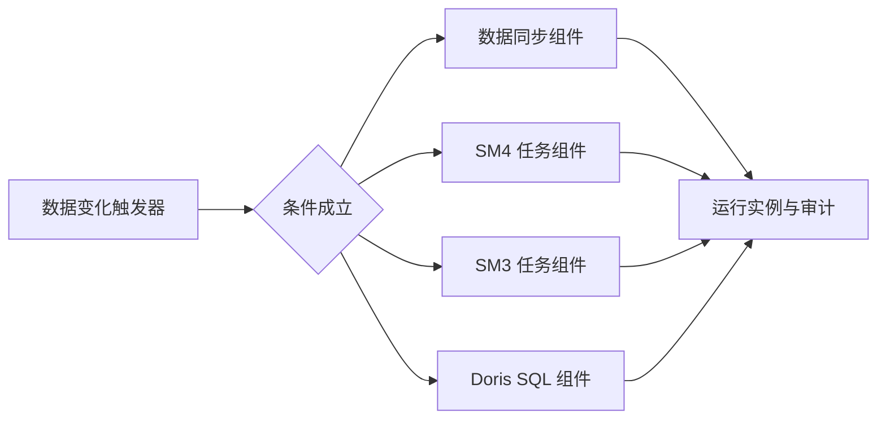

# 数据变化触发器与数据同步组件 PRD

更新时间：2026-07-15

## 1. 背景与目标

原“自动快照加密”同时承担数据探测、触发调度、全量同步和字段 SM4 加密，配置职责重叠，无法清晰表达失败重试、水位推进和版本冻结。

本次将其拆分为四层：

1. 数据变化触发器：只判断何时执行。
2. 数据同步、SM4、SM3、Doris SQL 组件：只定义执行内容。
3. 工作流发布版本：冻结节点、连线、触发规则和组件业务配置。
4. 运行态：保存探测值、水位、在途运行和审计，不参与版本一致性判断。

底层仍使用周期轮询，不宣称为 Binlog CDC。没有可靠水位字段时，只能探测指标变化并触发全量处理，不能保证识别同行数更新、删除或历史数据修改。

## 2. 数据变化触发器

### 2.1 监控来源

- 直接数据对象：Doris 连接、数据库、表、字段。
- 引用执行组件：数据同步、SM4、SM3、Doris SQL 节点，并从组件快照解析默认连接、数据库和表。

### 2.2 指标与条件

支持指标：`row_count`、`max`、`min`、`schema_signature`、`table_exists`、只读单值 `scalar_sql`。

支持条件：`changed`、`increased`、`increase_by`、`increase_percent`、`greater_than`、`equals`、`became_true`；多条件使用 `AND` 或 `OR`。

标量 SQL 只允许单条 `SELECT` 或 `WITH` 查询，禁止多语句和写操作。

### 2.3 触发控制

- 探测间隔为 1 至 1440 分钟。
- 首次策略支持只建立基线、立即触发、等待人工确认。
- 支持连续满足 N 次、防抖、最短重复触发间隔和执行窗口。
- 在途策略支持合并、跳过、排队；排队最多保留最近 100 个不同水位。
- 支持暂停、恢复、立即探测、查看探测记录和确认后重建基线。
- 暂停状态必须跨服务重启保留；运行中的触发器不得重建基线。
- 单个触发器探测失败不得阻断其他触发器，失败原因写入状态和服务日志，并按重试间隔继续。

### 2.4 三态水位

- `observed_value`：最近一次实际探测值。
- `pending_value`：已经触发但尚未成功处理的值。
- `applied_value`：最近一次下游工作流成功对应的值。

只有下游工作流整体成功，才能将本次运行上下文中的 `pending_value` 推进为 `applied_value`。失败、部分成功、取消、服务重启或派发失败均不得推进；服务启动时必须立即释放中断运行的关联 `pending_run_id`，变化继续保留并按启用或暂停状态处理。

## 3. 数据同步组件

### 3.1 配置

- 源 Doris 连接、源 Catalog、源 Schema。
- 目标 Doris 连接、目标 Doris 库。
- 表映射、表启用状态、目标表名、字段映射和目标字段类型。
- 写入策略、同步方式、结构基准策略和批次大小。
- Stream Load 兼容参数：HTTP 端口、字段分隔符、换行符、严格模式和容错比例。
- 被数据变化触发器引用时，可从触发上下文传入水位值；独立运行不推进触发器水位。

### 3.2 当前正式写入与同步策略

- 写入策略：
  - `append`：向已有或自动创建的目标表追加写入。
  - `truncate_insert`：完成目标表、结构和字段映射校验后，先清空目标表再写入。
- 同步方式：
  - `insert_select`：通过 Doris Catalog 联邦查询执行 `INSERT INTO target SELECT ... FROM catalog.schema.table`。
  - `stream_load`：应用层读取源表批次数据，转为 CSV 字节流后调用目标 Doris Stream Load。
  - `auto`：由后端按配置解析为实际执行方式；前端只负责给出默认建议，后端日志必须记录真实执行方式。
- 结构基准：
  - `source`：以源表结构为准；目标表不存在时自动建表，目标表缺少源字段时按类型映射自动 `ALTER TABLE ADD COLUMN`。
  - `target`：以目标表结构为准；只写入当前目标字段映射，目标缺失字段不自动补齐。
- 字段映射：
  - 启用字段至少需要选择一个源字段或固定值；禁止全部启用字段均写入 `NULL` 后仍显示成功。
  - 目标字段名不得重复，源字段必须真实存在。
  - 字符类字段长度按源字段长度的 2 倍映射到 Doris，并受 Doris 类型上限约束；数值、日期、布尔、二进制等字段按常用类型映射表转换。

历史兼容字段 `full_replace`、`incremental_append`、`primary_key_merge` 仅用于旧任务读取和迁移说明，不作为当前页面新建任务的正式写入策略。未来如恢复这些策略，必须重新补充 PRD、实现和回归用例。

源对象与目标对象完全相同时禁止执行。`truncate_insert` 必须在目标表存在、结构策略处理和有效字段映射校验之后才允许清空目标表，避免校验失败时误清空业务数据。

### 3.3 独立运行日志与审计

- 数据同步独立任务从页面点击“运行全部”或“运行选中”时，必须创建独立运行记录，记录运行 ID、任务 ID、任务修订、运行范围、状态、摘要、表级结果和详细日志。
- 页面运行日志不得只依赖任务配置中的最近一次 `last_result`；最近一次结果可以保留在任务配置中用于列表摘要，但完整日志必须从运行记录读取。
- 后端执行“运行选中”时，只能校验并执行本次选中的表映射；执行“运行全部”时，只能校验并执行启用的表映射。未勾选或禁用映射不得因为目标表名、字段名或字段映射异常阻断本次运行。
- 配置校验失败也必须写入独立运行记录，并说明映射 ID、源表、目标表、失败字段和失败值；如果失败发生在 SQL 构建前，日志必须明确“尚未生成 SQL”。不得只返回“目标表只能包含...”这类缺少上下文的泛化错误。
- 进入表执行阶段后，必须记录关键 SQL：自动建表 SQL、补字段 `ALTER TABLE` SQL、`TRUNCATE TABLE` SQL、Catalog `INSERT INTO ... SELECT ...` SQL 或 Stream Load 目标和返回。涉及敏感连接凭据时必须脱敏。
- 运行记录必须区分：
  - 请求未发出或鉴权失败；
  - 后端接口异常；
  - 任务整体失败；
  - 单表失败但继续执行后的部分成功；
  - 用户只运行选中表。
- 离线开发和触发器编排运行继续复用 `data_platform_workflow_runs` 和 `data_platform_node_runs`；独立数据同步运行记录只服务数据同步任务页面，不改变已上线工作流快照语义。

### 3.4 多表任务表级执行节点与并行度

- 一个多表数据同步任务仍然只创建一条总运行记录，表示本次“运行全部”或“运行选中”的整体执行。
- 总运行记录下必须为本次实际参与执行的每张表创建一个表级运行节点，记录映射 ID、源 Catalog、源 Schema、源表、目标库、目标表、同步方式、写入策略、结构基准、状态、写入行数、错误信息、开始时间、结束时间和耗时。
- 表级节点状态至少包括：`queued`（等待中）、`running`（运行中）、`succeeded`（成功）、`failed`（失败）、`skipped`（跳过）。页面可在此基础上按日志阶段展示“结构检查中、建表/补字段中、清空目标表中、写入数据中”等阶段。
- 表内执行步骤保持串行：结构检查、目标表创建、目标字段补齐、`TRUNCATE TABLE`、Catalog `INSERT SELECT` 或 Stream Load 写入必须按原有安全顺序执行。不得因为引入表级并行而打乱单表内部顺序。
- 多表之间支持可配置并行度。默认并行度为 `1`，保持旧任务串行语义；任务可配置表级并行度，后端必须限制最大并行度，默认最大值为 `8`，并允许通过环境变量 `DATA_SYNC_MAX_TABLE_PARALLELISM` 调整。
- 当并行度为 `N` 时，同一任务内最多同时执行 `N` 张表；任一表完成后调度下一张等待表。
- `continue_on_error=true` 时，单表失败不影响其他等待表继续调度；总任务按成功/失败数量标记为成功、部分失败或失败。
- `continue_on_error=false` 时，首个表失败后不再调度新的等待表；已经运行中的表允许完成，未开始的表标记为跳过，总任务标记为失败或部分失败。
- 运行过程中必须实时持久化总运行摘要、表级节点状态和表级日志。页面刷新或重新进入日志页时，不能等全部表完成后才看到进度；已经开始、完成或失败的表必须可见。
- 运行记录列表接口默认只返回轻量摘要和表级节点摘要，不得把所有表的完整 SQL 日志塞进最近 30 条运行记录的大 JSON。点击某张表时再读取该表日志明细，避免系统 MySQL 排序和 JSON 响应过大导致 `component-runs` 查询 500。
- 表级日志必须包括该表相关关键 SQL 和执行阶段：建表 SQL、补字段 `ALTER TABLE` SQL、`TRUNCATE TABLE` SQL、Catalog `INSERT INTO ... SELECT ...` SQL 或 Stream Load 请求与返回摘要。敏感连接凭据不得写入日志。

### 3.5 百表长耗时任务的连接恢复与故障隔离

- Doris MySQL 协议连接、Catalog 切换、元数据读取和表写入属于运行阶段，不得把连接关闭、网络中断、FE/BE 暂时不可用或 Catalog 连接池异常包装成“表映射配置无效”。日志必须保留异常类型、原始错误码、源端/目标端角色、执行阶段、重试次数和 SQL 是否已经生成。
- `SWITCH Catalog` 的兼容语法回退只允许在明确的 SQL 语法或解析错误时执行；连接异常不得在同一个已关闭 socket 上再次执行。目标表存在性检查只允许把真实的“不存在”判定为 `false`，不得吞掉连接异常后假定目标表不存在。
- 每张表仍使用独立源端和目标端连接。开始元数据检查前必须建立新连接；发现 PyMySQL `InterfaceError(0)`、`OperationalError(2006/2013/2014/2055)`、连接重置、超时等可恢复基础设施错误时，关闭当前连接并重新建立，禁止继续使用已失效连接。
- 默认每张表最多执行 3 次连接级尝试。第一次连接异常后进入共享恢复门控，同一任务并行线程只允许一个线程执行源端、源 Catalog 和目标端健康探测，其他线程暂停等待，避免同时重连形成故障风暴。默认最多探测 30 次、间隔 10 秒，即最多等待约 5 分钟；该内部参数允许测试或运维配置覆盖，但本次不新增页面字段。
- 只有在目标写入请求尚未发出时，才允许连接恢复后自动重试当前表。已经执行或可能已经发出 `TRUNCATE TABLE`、Catalog `INSERT SELECT` 或任一批 Stream Load 后，如果连接中断导致结果未知，必须停止该表自动重试，记录“写入结果未知，需核对目标表”，避免追加模式重复写入或清空模式重复执行。
- 写入后连接异常仍需进入共享健康恢复门控；健康恢复成功后，当前表保持失败或待人工核对，后续表可以继续。恢复窗口耗尽仍不可用时，当前表记录基础设施失败，尚未开始的表统一标记为 `skipped`，说明因 Doris/Catalog 基础设施未恢复而未执行，不能把剩余所有表逐张快速判为映射失败。
- `continue_on_error` 只控制真实的单表配置或业务失败。基础设施连接连续不可用时必须优先执行恢复门控和停止扩散策略，不受 `continue_on_error=true` 影响。
- 运行日志中的 SQL 状态必须真实：尚未构建任何 SQL 时显示“尚未生成 SQL”；已经构建 SQL 时记录最后一条脱敏 SQL；写入请求已经发出时明确标记 `write_started=true`。不能以“存在任意准备日志”代替 SQL 已生成判断。
- 百表大数据任务建议默认表级并行度为 1；需要并行时应结合 Doris FE/BE、外部 Catalog JDBC 连接池、源库 `sessions/processes`、目标磁盘和 Compaction 能力逐步提升。应用最大并行度限制继续生效，但不能把最大值 8 视为所有生产任务的推荐值。

## 4. 组件与密钥解耦

- SM4、SM3节点绑定明确任务修订和任务快照。
- 任务产生新修订时，已有开发节点不得静默升级；页面提示后由用户显式更新。
- 生产版本始终执行提交时冻结的任务快照。
- SM4 密钥创建、轮换和函数部署独立进行，任务保存、提交、手动执行及调度执行不得隐式刷新密钥。
- 运行时按“Doris 连接 + 目标数据库”绑定当前成功部署并验证的密钥版本，并在批次记录实际版本和指纹。

## 5. 发布版本与内容哈希

`release_snapshot` 冻结节点、连线、时间调度、变化触发规则和组件配置。`execution_content_hash` 对影响执行结果的内容规范化后计算。

纳入哈希：组件业务配置、节点连接关系、连接和库表字段、写入模式、水位规则、触发条件、失败/重叠策略、执行窗口和时间调度规则。

不纳入哈希：任务 ID和修订号、SM4密钥版本和指纹、JAR 文件名、画布坐标、显示名称、最近探测值、水位、运行 ID及批次 ID。

相同业务内容重复提交复用已有生产版本；流程节点、连线、组件任务快照或变化触发规则发生变化时必须回开发版重新提交。上线版本的时间调度属于独立运维配置，允许修改启用状态、调度周期、执行时间、日/周和间隔；保存后更新调度快照、内容哈希和下次执行时间，但不得改变已冻结的流程节点、连线及组件任务快照。

## 6. 兼容与迁移

- 旧“自动快照”页面入口和自动巡检停止使用。
- 历史自动快照任务、批次和审计记录保留，不删除历史源码或数据。
- 历史工作流启动时回填发布快照和内容哈希；引用任务已归档、已删除或 ID异常时保留原节点并记录告警，不得导致应用启动失败。
- 时间调度和变化触发器是两个独立入口，可以同时存在；调度中心必须按实际 `trigger_type` 区分手动、时间调度和数据变化触发。

## 7. 验收标准

1. 行数不变但 `MAX(update_time)` 增大时能够触发。
2. 下游失败或部分成功时不推进 `applied_value`，恢复后可重试。
3. 在途运行期间的新变化按合并、跳过、排队策略分别处理。
4. 暂停状态在服务重启后保持，暂停期间不自动探测。
5. 单个探测失败可见错误且不影响其他触发器。
6. SM4/SM3新修订不改变已上线版本，开发节点只在显式更新后升级。
7. 密钥轮换不改变 `execution_content_hash`，新批次记录实际密钥版本。
8. 相同内容重复提交复用生产版本；触发规则或同步策略变化生成不同哈希。
9. 全量同步校验失败时正式目标表保持可用，不进行切换。
10. 同连接跨库、跨连接同步均完成字段与行数校验。
