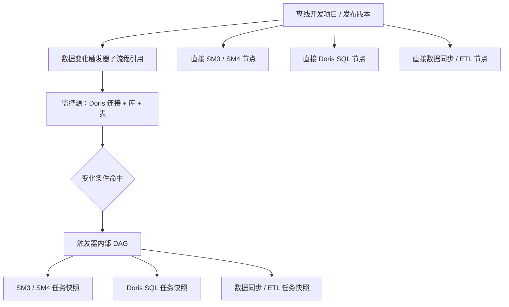
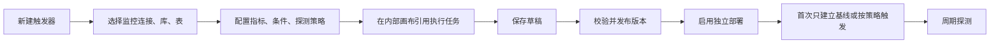
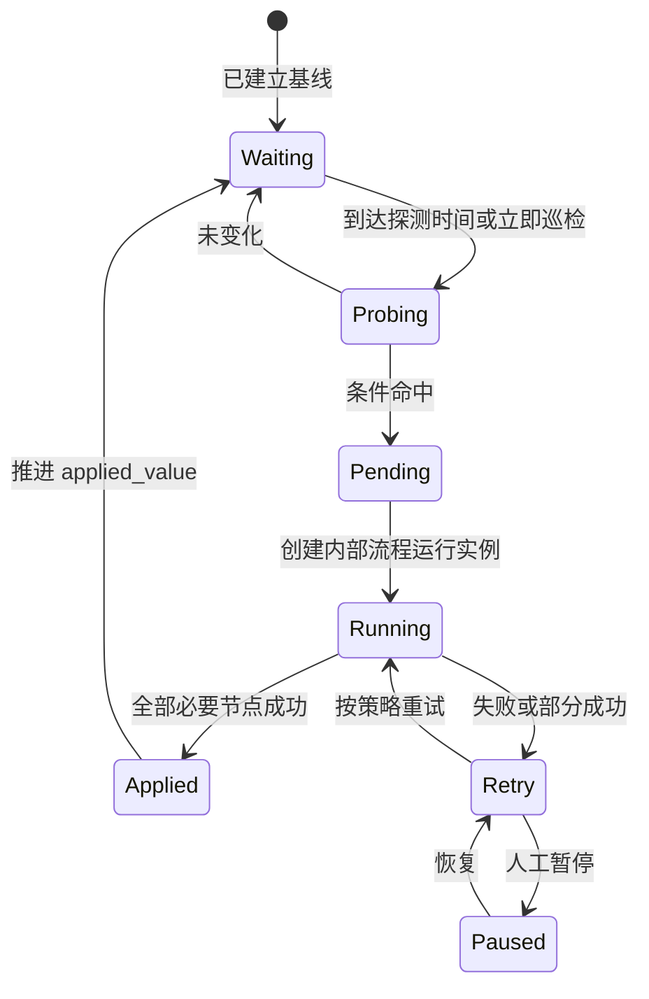

# 数据变化触发器与嵌套编排 PRD V2

更新时间：2026-07-16  
状态：需求确认稿  
适用模块：数据变化触发器、离线开发、SM3、SM4、Doris SQL、数据同步/ETL

## 1. 背景

当前系统已经具备数据变化探测、三态水位、重叠处理和离线流程下游分支执行能力，但“触发器任务”只保存监控条件，触发后的执行过程仍要求用户到离线开发画布中配置。

这会产生以下问题：

- 触发器不能独立表达“监控什么、命中后做什么”。
- 用户必须在两个模块之间来回配置，触发器任务本身不是完整可运行资产。
- 同一个触发器被多个流程使用时，下游节点容易重复配置且难以保持一致。
- 触发器页面无法直接查看完整执行链、节点版本、失败位置和影响范围。
- 当前离线画布把触发器当普通入口节点，无法表达“触发器内部还有一个执行子流程”的层级。

本 PRD 将数据变化触发器升级为独立的“事件驱动子流程”。

## 2. 目标

1. 用户可以在数据变化触发器模块独立创建一个完整任务，包含监控对象、触发条件和触发后的执行画布。
2. 触发器内部可以引用已经保存的 SM3、SM4、Doris SQL、数据同步/ETL 任务。
3. 离线开发可以引用整个触发器子流程，也可以直接编排 SM3、SM4、SQL、ETL 等普通节点。
4. 触发器、离线流程和被引用任务均具备清晰的版本冻结、更新提示和运行审计。
5. 数据变化只有在内部执行流程整体成功后才推进应用水位，失败可重试且不丢变化。

## 3. 需求解构与边界

用户提出的总体层级正确，但需要闭合以下边界。

### 3.1 唯一执行归属

触发后的执行节点只在触发器内部画布管理。离线开发引用触发器后，不允许再从该触发器外接一套下游节点，否则同一次变化可能重复执行两套流程。

### 3.2 禁止递归触发器

触发器内部允许的节点为：

- SM3 映射脱敏任务
- SM4 加密任务
- Doris SQL 任务
- 数据同步/ETL 任务
- 后续可扩展的检查、通知和人工确认节点

触发器内部不允许再引用另一个触发器，也不允许引用包含当前触发器的离线流程。

### 3.3 触发器不是普通同步节点

离线开发中的触发器节点是一个“已发布子流程引用”，不是执行到该节点时临时等待数据变化的阻塞节点。

- 发布离线版本：注册或更新该触发器部署实例。
- 下线离线版本：停用由该版本部署的触发器实例。
- 手动或时间调度运行离线流程：只运行普通执行图，不等待触发器。
- 数据变化命中：由触发器部署实例独立启动内部执行图。

### 3.4 第一阶段监控范围

一个触发器定义一个主监控表，可以对该表配置多个指标并使用 `AND` 或 `OR` 组合。跨表关联监控不在第一阶段直接支持；需要监控多个表时创建多个触发器，避免水位和失败恢复语义不清。

## 4. 总体层级



## 5. 业务流程

### 5.1 独立创建并启用触发器



### 5.2 数据变化后的执行流程



### 5.3 离线开发引用触发器

1. 用户在离线开发画布添加“触发器子流程”节点。
2. 节点只能选择已发布的触发器版本。
3. 节点以折叠容器展示触发器名称、版本、监控表和内部节点数量。
4. 双击节点可只读查看内部画布；“编辑源任务”跳转触发器模块的开发版。
5. 提交离线版本时冻结所选触发器版本及其内部任务快照。
6. 离线版本上线时创建部署来源为 `offline_workflow` 的触发器部署实例。
7. 离线版本下线时，只停用由该离线版本创建的部署实例，不影响触发器的其他独立部署。

## 6. 数据变化触发器页面

### 6.1 页面结构

页面采用三段式工作区，不与离线开发页面混排：

- 左侧固定宽度：触发器目录和任务列表。
- 中间主区域：触发器内部画布。
- 右侧属性面板：当前选中的监控节点、执行节点或连线配置。
- 底部抽屉：运行记录、探测记录、节点日志和版本历史。

左侧触发器任务列表采用与离线开发一致的紧凑目录树视觉：固定行高、文件夹/任务图标、轻量选中态和固定高度滚动。任务行不展示“打开/删除”等行内按钮；打开、重命名、复制和删除均通过右键菜单完成。第一阶段使用单层“触发器任务”根目录，不额外引入触发器文件夹数据模型。

### 6.2 顶部工具栏

必须提供：

- 新建
- 保存草稿
- 删除
- 校验
- 发布
- 启用/暂停
- 立即巡检
- 运行一次内部流程
- 版本历史
- 查看引用关系

“运行一次内部流程”跳过变化判断，用模拟触发上下文执行当前开发版，仅用于联调；不得推进生产部署的 `applied_value`。

### 6.3 固定监控入口节点

每个触发器画布只能有一个固定的“数据变化监控”入口节点，不能删除，也不能有上游连线。

入口节点配置包括：

- Doris 连接
- Catalog，默认 `internal`
- 数据库
- 数据表
- 探测间隔
- 首次策略
- 执行时间窗口
- 连续命中次数
- 最小触发间隔
- 运行重叠策略
- 失败重试间隔和最大重试次数

### 6.4 监控条件

支持一个主表上的多个条件：

- `row_count`
- `max(column)`
- `min(column)`
- `schema_signature`
- `table_exists`
- 只读单值 `scalar_sql`

比较方式：

- `changed`
- `increased`
- `increase_by`
- `increase_percent`
- `greater_than`
- `equals`
- `became_true`

标量 SQL 只允许单条 `SELECT` 或 `WITH`，因为它属于探测表达式，不属于 Doris SQL 工作台的通用执行权限。

#### 6.4.1 监控对象元数据联动

监控对象固定按以下顺序选择，元数据来自当前 Doris 连接的 `internal` Catalog：

```text
Doris 连接 -> 数据库 -> 数据表 -> 指标字段
```

- 数据库、数据表和指标字段均使用下拉列表，不允许手工输入。
- 切换 Doris 连接时，立即清空数据库、表和字段，并重新读取数据库列表。
- 切换数据库时，立即清空表和字段，并重新读取表列表。
- 切换数据表时，立即清空字段，并重新读取字段列表。
- 加载过程必须显示“加载中”；无可用对象和读取失败必须给出明确状态。
- 用户快速连续切换连接、库或表时，只允许最后一次请求更新页面，旧请求不得覆盖新结果。
- 编辑已有任务时必须依次完成连接、数据库、表和字段的异步加载后再回填；历史对象已不存在或读取失败时，保留原值作为带“历史配置”标识的临时选项。

#### 6.4.2 条件字段动态展示矩阵

“按条件动态展示”是硬性需求。页面不得一次性展示所有无关字段，隐藏字段必须同步清空且不提交。

| 判定指标 | 指标字段 | 标量 SQL | 可用比较规则 |
|---|---|---|---|
| `row_count` | 隐藏 | 隐藏 | `changed`、`increased`、`increase_by`、`increase_percent`、`greater_than`、`equals` |
| `max` | 显示且必填 | 隐藏 | `changed`、`increased`、`increase_by`、`increase_percent`、`greater_than`、`equals` |
| `min` | 显示且必填 | 隐藏 | `changed`、`increased`、`increase_by`、`increase_percent`、`greater_than`、`equals` |
| `schema_signature` | 隐藏 | 隐藏 | `changed`、`equals` |
| `table_exists` | 隐藏 | 隐藏 | `changed`、`equals`、`became_true` |
| `scalar_sql` | 隐藏 | 显示且必填 | `changed`、`increased`、`increase_by`、`increase_percent`、`greater_than`、`equals`、`became_true` |

阈值显示规则：

- `increase_by`、`increase_percent`、`greater_than`、`equals` 显示阈值输入框并要求填写。
- `increase_percent` 的阈值单位为百分比 `%`。
- `changed`、`increased`、`became_true` 隐藏并清空阈值。
- 指标变化后必须重新生成比较规则列表；原规则不再合法时自动切换到该指标的第一个默认规则。
- 非 `scalar_sql` 指标必须选择数据表；`max`、`min` 必须选择指标字段；`scalar_sql` 必须填写单条只读标量查询。
- 前端提交前校验和后端保存规范化必须使用同一矩阵，非法组合不得保存或发布。

### 6.5 内部画布节点

用户从节点面板拖入节点后，必须选择对应模块中已保存的任务，不在触发器画布重复填写完整业务参数。

节点展示：

- 任务名称
- 任务类型
- 当前绑定修订
- 是否存在新修订
- 目标连接、库、表摘要
- 最近一次运行状态

节点操作：

- 选择任务
- 新建对应任务并返回绑定
- 更新到最新修订
- 查看任务详情
- 单击节点后按 `Delete` 删除；固定监控入口不可删除。
- 节点右键菜单提供复制、编辑、重命名和删除；固定监控入口只提供编辑。
- 复制出的节点先作为游离节点存在，必须完成连线后才能保存。
- 节点坐标属于画布展示状态，拖动节点不会改变任务执行语义。
- 设置超时、重试和失败策略

右侧属性面板只维护当前节点的任务选择与业务属性，不重复展示前移、后移和删除按钮。执行顺序完全由显式连线决定，不再根据节点数组顺序自动生成。

### 6.6 连线与执行规则

- 画布为有向无环图，禁止环路。
- 固定监控入口是唯一首节点，不能有入边，至少连接一个执行节点。
- 节点悬停或选中时显示输入/输出端口；从节点底部输出端口拖动到目标节点建立有向连线。
- 连线可单击选中后按 `Delete` 删除，也可通过右键菜单删除。
- 连线端点必须引用现有节点，禁止自环、重复边和指向监控入口的边。
- 所有执行节点必须能从监控入口到达；未连线或无法到达的节点标记为游离节点并禁止保存。
- 保存、校验和发布均使用同一套后端 DAG 校验，不能通过直接调用接口绕过画布限制。
- 支持串行和并行分支。
- 多上游节点默认全部成功后才执行下游节点。
- 节点失败默认阻断其下游，不影响无依赖的并行分支继续完成。
- 只要任一必要节点失败，触发器本次运行整体为失败或部分失败，不推进应用水位。
- 第一阶段不提供触发器嵌套、循环节点和动态脚本节点。

## 7. 版本与引用规则

### 7.1 三层版本

1. 业务任务修订：SM3、SM4、Doris SQL、数据同步/ETL 自身的修订。
2. 触发器版本：冻结监控配置、内部节点、连线和业务任务快照。
3. 离线流程版本：冻结触发器已发布版本和其他直接节点快照。

### 7.2 修改影响

| 操作 | 已发布触发器 | 已上线离线版本 | 下次运行 |
|---|---|---|---|
| 修改并保存 SM4/SM3/SQL/ETL 任务 | 不自动变化 | 不自动变化 | 仍运行原快照 |
| 在触发器草稿点击“更新到最新修订” | 草稿变化 | 不变化 | 草稿重新发布后生效 |
| 发布触发器新版本 | 旧部署保持原版本 | 已上线离线版本保持原版本 | 新独立部署可选择新版本 |
| 离线开发更新触发器引用并重新上线 | 不影响独立部署 | 生成新的离线发布版本 | 新运行使用新冻结版本 |

生产运行禁止“自动跟随最新版”。页面发现新版本时只提示影响范围，由用户显式更新并重新发布。

### 7.3 重复部署保护

同一触发器版本可能被独立启用，也可能被多个离线版本引用。系统必须以“触发器定义 + 版本 + 部署作用域”识别部署实例，并提供重复监控提示。

默认规则：同一个环境、同一个触发器版本、同一监控对象只允许一个启用中的实际探测实例；其他引用复用该实例并增加引用关系，避免同一变化被重复消费。

## 8. 运行时语义

### 8.1 三态水位

- `observed_value`：最近一次实际探测结果。
- `pending_value`：已经命中但尚未成功应用的变化。
- `applied_value`：内部执行图整体成功后确认完成的变化。

内部执行图全部必要节点成功后，才允许将 `pending_value` 推进为 `applied_value`。

### 8.2 重叠策略

- `merge`：运行期间出现新变化时合并为最新待处理值，当前运行结束后再执行一次。
- `queue`：按变化水位排队，保留上限 100 条，依次执行。
- `skip`：当前运行期间的新变化只记录探测日志，不创建新的运行；页面必须明确提示可能遗漏中间状态。

默认使用 `merge`。

### 8.3 执行窗口

触发器可以全天探测，但动作流程只在配置窗口内消费。例如配置 `22:00-09:00`：白天命中的变化进入等待，晚上 22 点后开始执行；早上 9 点仍未开始的任务继续等待到下一窗口。

已经进入运行状态的任务默认执行到结束，不在 9 点强制中断。

### 8.4 失败恢复

- 探测失败与动作执行失败分别记录。
- 探测失败不修改 `observed_value`、`pending_value` 和 `applied_value`。
- 动作失败保留 `pending_value`，按节点与触发器策略重试。
- 服务重启后释放失联的运行锁，根据持久化状态恢复。
- 人工可执行重试、跳过节点、终止运行和重建基线；跳过必要节点不得推进应用水位。

## 9. 数据模型建议

### 9.1 触发器定义表

`data_change_trigger_definitions`

- `id`
- `name`
- `description`
- `current_revision`
- `draft_monitor_config`
- `draft_nodes`
- `draft_edges`
- `status`
- 创建人、创建时间、更新时间、归档时间

### 9.2 触发器版本表

`data_change_trigger_versions`

- `id`
- `trigger_definition_id`
- `version_no`
- `monitor_snapshot`
- `nodes_snapshot`
- `edges_snapshot`
- `execution_content_hash`
- `published_by`
- `published_at`

### 9.3 部署与引用表

`data_change_trigger_deployments`

- `id`
- `trigger_version_id`
- `deployment_source`：`standalone` 或 `offline_workflow`
- `source_workflow_version_id`
- `enabled`
- `probe_owner_deployment_id`：复用其他探测实例时指向实际所有者
- `deployed_at`
- `undeployed_at`

### 9.4 运行状态表

沿用并升级现有 `data_platform_change_trigger_states`，运行状态必须绑定 `deployment_id` 和 `trigger_version_id`，不能只依附离线版本节点。

继续保存：

- 最近探测时间、下次探测时间
- `observed_value`
- `pending_value`
- `applied_value`
- 待处理队列
- 当前运行 ID
- 连续命中次数
- 最近成功时间
- 状态和消息

### 9.5 运行与节点日志

触发器运行实例和内部节点运行记录复用离线执行器的运行模型，但必须增加：

- `trigger_definition_id`
- `trigger_version_id`
- `deployment_id`
- `probe_id`
- `trigger_context`
- 实际业务任务修订和快照摘要

## 10. API 建议

- `POST /data-change-triggers`：新建定义
- `GET /data-change-triggers`：任务列表
- `GET /data-change-triggers/{id}`：读取草稿和当前版本
- `PATCH /data-change-triggers/{id}`：保存草稿
- `DELETE /data-change-triggers/{id}`：归档任务
- `POST /data-change-triggers/{id}/validate`：校验监控配置和内部 DAG
- `POST /data-change-triggers/{id}/publish`：发布新版本
- `GET /data-change-triggers/{id}/versions`：版本历史
- `POST /data-change-triggers/{id}/deploy`：独立启用指定版本
- `POST /data-change-trigger-deployments/{id}/pause`：暂停
- `POST /data-change-trigger-deployments/{id}/resume`：恢复
- `POST /data-change-trigger-deployments/{id}/probe`：立即巡检
- `POST /data-change-triggers/{id}/dry-run`：运行一次开发版内部流程
- `GET /data-change-trigger-deployments/{id}/runs`：运行记录
- `GET /data-change-trigger-deployments/{id}/probes`：探测记录
- `GET /data-change-triggers/{id}/references`：查看离线流程引用关系

旧的 `/data-platform/change-triggers` 接口在迁移期保留，只读映射到新部署模型。

## 11. 权限与审计

权限建议拆分为：

- `dataChangeTrigger:read`
- `dataChangeTrigger:design`
- `dataChangeTrigger:publish`
- `dataChangeTrigger:deploy`
- `dataChangeTrigger:execute`
- `dataChangeTrigger:monitor`

审计必须记录：保存、发布、启停、立即巡检、重建基线、更新任务修订、重试、终止和删除操作。

触发器执行 SM3、SM4、SQL 或 ETL 时，仍使用被引用任务配置的数据库连接账号，数据库权限由对应数据库负责。

## 12. 兼容迁移

1. 识别当前已上线离线版本中的 `change_trigger` 入口及其可达下游节点。
2. 将入口配置迁移为触发器定义，将可达下游 DAG 迁移为触发器内部画布。
3. 冻结原下游任务快照，生成触发器 V1 版本。
4. 原离线画布中的入口与下游分支替换为一个折叠的触发器子流程引用。
5. 迁移前后保持原运行状态、水位、探测日志和运行日志关联。
6. 无法自动迁移的循环、共享下游或多触发器交叉分支标记为“待人工拆分”，禁止静默改变执行语义。

## 13. 验收标准

1. 在触发器模块可以完成监控表、条件、策略和内部执行 DAG 的全部配置，无需进入离线开发补充下游节点。
2. 内部画布能够引用 SM3、SM4、Doris SQL、数据同步/ETL 已保存任务，并正确显示修订状态。
3. 保存草稿不会改变正在运行的生产版本；发布和部署后才生效。
4. 离线开发能够选择已发布触发器，提交后冻结完整嵌套快照。
5. 禁止触发器嵌套触发器、循环连线、无执行节点发布和外部重复下游配置。
6. 行数不变但 `MAX(update_time)` 变化时能够触发内部流程。
7. 串行、并行和多上游汇合均按 DAG 规则执行。
8. 任一必要节点失败时不推进 `applied_value`，恢复后能够重试同一 `pending_value`。
9. 运行期间出现新变化时，`merge`、`queue`、`skip` 三种策略结果符合定义。
10. 独立部署和离线引用同一触发器时不会产生两个实际探测实例和重复执行。
11. 页面可追溯探测记录、触发上下文、内部节点结果、实际任务修订和数据库错误。
12. 服务重启后触发器启停状态、水位、等待队列和失败任务均可恢复。

## 14. 实施建议

### 第一阶段：模型与执行器

- 拆出独立触发器定义、版本和部署模型。
- 将现有触发器分支执行逻辑改造成可复用的嵌套 DAG 执行器。
- 保留现有三态水位、探测条件、重叠与恢复逻辑。

### 第二阶段：独立画布

- 在触发器模块实现内部画布、任务选择、保存、校验、发布和版本历史。
- 完成 SM3、SM4、Doris SQL、数据同步/ETL 任务引用与修订更新。

### 第三阶段：离线嵌套与迁移

- 离线开发新增触发器子流程容器节点。
- 实现递归快照、重复部署保护和旧流程迁移工具。
- 补齐引用关系、影响范围提示和发布校验。

### 第四阶段：完整验证

- 使用真实 Doris 表制造新增、更新、删除和结构变化。
- 验证串行、并行、失败重试、窗口等待、服务重启和多版本引用。
- 使用真实 Chrome 验证最大化、半屏和普通窗口下的画布、属性面板和日志抽屉。
