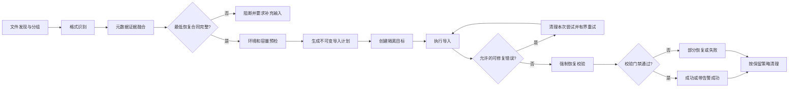

# Oracle 全类型恢复能力改进需求文档

## 1. 文档信息

| 项目 | 内容 |
|---|---|
| 文档状态 | 建议稿，待产品与技术评审 |
| 版本 | V1.0 |
| 日期 | 2026-07-14 |
| 依据 | Oracle 19c 代替 Oracle 11g 导出与现有系统导入兼容性测试，29 个实际用例 |
| 适用系统 | 当前 `embedded-oracle` 专业恢复流程 |
| 本文范围 | Oracle dump 发现、探测、计划、导入、纠错、校验、状态和资源清理 |
| 不包含 | 本文不直接修改产品代码，不把 Oracle 19c 测试等同于 Oracle 11g 实机认证 |

## 2. 结论摘要

系统不应以“先默认执行 `impdp/imp`，再根据报错无限修命令”作为主流程。报错驱动可以保留，但只能是有边界、可解释、可回滚的纠错层。主流程必须先形成明确的恢复合同：dump 格式、导出模式、内容类型、源 schema、目标映射、冲突策略、预期对象及校验规则。无法建立最低恢复合同的任务应停止并要求人工补充，而不是猜测后执行。

### 2.1 Oracle 19c 运行中停止硬性要求

本能力只适用于当前 Oracle 19c 自动导入链路，不修改、不部署、不验证 Oracle 21c 相关镜像、容器、脚本或配置。

- 排队中的 `created` 任务继续使用“取消排队”。
- 已建立运行控制信息的 `policy_running`、`importing`、`correcting` 任务提供“停止导入”。
- 每次 Data Pump 探测、正式导入和回退导入必须使用由任务 ID 与运行 ID 生成的唯一 `JOB_NAME`，并持久记录运行目录、容器和 Job 名称。
- 普通停止先写入持久化停止请求和远端 `stop.request`，再对当前任务的 Data Pump Job 执行 `STOP_JOB=IMMEDIATE`。
- 普通停止后 Job 保留恢复能力；页面状态进入 `stopping`，只有 Worker 确认远端命令退出后才进入 `cancelled`。
- 优雅停止长期未完成时，用户可显式选择“强制终止”；强制终止执行 `KILL_JOB` 并只终止当前任务记录的远端进程，不允许使用 `pkill impdp`、重启 Worker 或重启 Oracle 容器影响其他任务。
- 无论普通停止还是强制终止，已经导入成功的对象和数据均不回滚，页面必须明确提示并保留停止原因、操作人、时间、Job 名称和执行结果。
- Worker 正常返回或抛出异常时必须重新读取停止请求；用户主动停止的任务最终记为 `cancelled`，不得误记为 `failed`。
- 重试已停止任务时清空上一轮停止标记与运行控制信息，并生成新的运行 ID 和 Data Pump Job 名称。

建议将系统改造成以下闭环：



最重要的产品原则有六条：

1. `imp/impdp` 进程结束不等于恢复成功。
2. 未识别源 schema 时禁止自动做隔离恢复，尤其禁止传统 `imp FULL=Y IGNORE=Y`。
3. 导出模式必须进入导入计划，不能只记录在事件日志里。
4. 多源 schema 默认一对一映射到多个隔离目标 schema，禁止默认合并到一个 schema。
5. 任务成功必须同时满足执行结果和校验门禁。
6. 系统不得声称能从缺少必要信息的 dump 中恢复不存在的信息。例如，独立 `DATA_ONLY` dump 不能凭空重建表结构。

## 3. 实测依据和证据边界

本轮 29 个实际用例结果为：`PASS=10`、`PASS_WITH_WARNINGS=4`、`FAIL_IMPORT=3`、`FAIL_VALIDATION=6`、`EXPORT_BLOCKED=6`。以下结论只使用实际导出、当前系统导入、目标校验和源码实现作为依据。

### 3.1 已得到数据级验证的能力

- Data Pump 默认 schema、`SCHEMAS` 单 schema。
- `SCHEMAS` 多 schema，使用 `%U + FILESIZE` 且不启用并行。
- `TABLES` 单表、跨 schema 多表。
- 受 schema 过滤的 `FULL=Y`。
- `CONTENT=METADATA_ONLY`。
- `QUERY`、`SAMPLE`、`EXCLUDE=TABLE`。
- `FLASHBACK_SCN`、`FLASHBACK_TIME`。
- `VERSION=11.2` dump。
- `COMPRESSION=METADATA_ONLY`。

这些能力只能说明本次 Oracle 19c SE2 环境和当前数据集下可用，不能自动外推到所有 Oracle 版本、字符集和对象组合。

### 3.2 已实测暴露的当前系统缺陷

| 缺陷 | 实测现象 | 风险 |
|---|---|---|
| 传统 dump 无 schema 仍执行 | `schema_map={}` 时任务可返回成功 | 数据进入错误 owner，状态失真 |
| 传统多 OWNER 识别不完整 | 只识别 `C11_SRC_A`，遗漏 `C11_SRC_B` 和 LOB 表 | 静默漏恢复 |
| NETWORK_LINK 文本误解析 | `CONNECT TO` 中的 `TO` 被当成 schema | 生成错误 `SCHEMAS=TO,...` |
| DATA_ONLY 无计划 | SQLFILE 无 DDL，最终为 `unknown dump type` | 合法 dump 无法进入条件式恢复流程 |
| TABLESPACES 状态误判 | 导入出现 `ORA-39082` 和返回码 5 后整体失败 | 不能区分已导入对象和编译告警 |
| 资源未闭环 | 失败任务可留下 10 GiB 空表空间，任务目录保留 DMP 副本 | 磁盘快速耗尽 |

### 3.3 尚未被本报告验证的能力

下列用例因 Oracle 19c SE2 在导出阶段阻断或缺少必要文件，不能据此判断系统导入是否支持：

- Data Pump `PARALLEL` 生成的多文件 dump。
- 分区对象的完整导入。
- `COMPRESSION=ALL`。
- Dump File Encryption 和正确/错误密码处理。
- Transportable Tablespaces 的 dump、datafile、字节序转换和导入。
- Oracle 11g 二进制环境直接生成的 dump。
- 未过滤的全库 dump。
- 成功生成的传统 `exp FULL=Y` dump。

产品对上述能力应显示为“尚未认证”或“需要专用流程”，不得显示为已支持。

## 4. 当前实现的结构性问题

### 4.1 元数据模型不足

当前 `ExportMetadata` 只包含版本、模式、schema、表、表空间和文件名，未表达以下恢复关键语义：

- Data Pump 与传统 exp 的格式和格式版本。
- `CONTENT=ALL|DATA_ONLY|METADATA_ONLY`。
- 导出过滤条件以及对象是否被有意排除。
- 源 schema 是否完整、证据来自哪里、每个字段的可信度。
- 预期对象清单、对象数量和预期行数。
- 加密、压缩、传输表空间及所需伴随文件。
- 字符集、字节序、目标 Edition 兼容性。

结果是“探测到一个 schema”与“已经完整探测全部 schema”无法区分。

### 4.2 识别策略存在失败开放

当前无关联文本时先用 `impdp SQLFILE`，失败后用 `imp SHOW=Y`；两者都失败时仍默认返回 `imp`，只是置信度较低。存在关联文本但文本结论错误时，工具选择也会直接受文本影响。

目标策略必须是失败关闭：只有 Oracle 工具给出明确格式证据时才选择 `impdp` 或 `imp`；无法判断时进入 `PREFLIGHT_BLOCKED`，不能默认执行传统 `imp`。

### 4.3 导入计划未表达导出模式

当前专业流程的 `ImportPlan` 主要包含工具、dump 文件和日志文件。`ImpdpCommandSpec` 没有 `SCHEMAS`、`TABLES`、`TABLESPACES`、`FULL`、`CONTENT` 字段，导出模式虽被记录，却没有成为命令生成的强约束。

这导致表模式先以不匹配的方式执行，再依赖 `ORA-39039/ORA-31655` 回退。该机制可以作为兜底探测，但不应是正常路径。

### 4.4 传统 imp 默认行为危险

当前 `ImpCommandSpec` 默认 `full=True`、`ignore=True`，即自动生成 `FULL=Y IGNORE=Y`。同时 `run_imp` 以新建目标用户连接，但没有根据源 OWNER 生成 `FROMUSER/TOUSER`。

该组合无法保证恢复隔离，也无法证明多 OWNER 完整性。传统 dump 未识别 OWNER 时必须阻断，不允许执行。

### 4.5 多 schema 被默认合并

当前发现多个源 schema 后，会把多个 `REMAP_SCHEMA=源:同一目标` 追加到同一个目标 schema。该策略存在对象同名冲突、跨 schema 授权失真、同义词和依赖关系改变等风险。

默认策略应是每个源 schema 对应一个独立目标 schema。只有用户明确选择“合并 schema”，且预检确认没有同名对象冲突后，才允许多对一映射。

### 4.6 校验不是成功门禁

当前校验只统计目标 schema 的表数、对象数和 INVALID 对象。`ok` 仅表示校验 SQL 本身没有报错：表数为 0、对象数为 0、仍有 INVALID 对象时仍可能为 `ok=true`。专业流程最终状态也没有使用校验结果否决导入成功。

因此当前任务状态只能说明工具执行结果，不能说明恢复完整性。

### 4.7 重试可能基于部分导入现场继续执行

当前补充 `REMAP_SCHEMA` 后可直接再次执行 `impdp`。如果第一次尝试已创建部分对象，第二次在 `TABLE_EXISTS_ACTION=REPLACE` 下继续执行，无法证明重试是幂等的。

所有改变模式、schema 映射或对象选择范围的重试都必须清理本次尝试创建的隔离目标后重新开始，或者使用新的 attempt 目标。禁止在未知部分状态上继续重试。

### 4.8 容量与保留策略不合理

当前默认创建 10 GiB、`MAXSIZE UNLIMITED` 的 BIGFILE 表空间，并把全部 DMP/log/par 复制到运行目录。小 dump 和失败任务也会占用大块空间，且任务结束后缺少统一回收闭环。

## 5. 产品目标和非目标

### 5.1 产品目标

1. 对支持范围内的 Oracle dump，形成确定、可审计、可重放的导入计划。
2. 保证源 schema 到隔离目标的映射完整，不发生静默漏恢复或错误 owner 导入。
3. 支持 Data Pump 的 schema、table、tablespace、full、metadata-only，以及有前置条件的 data-only。
4. 对传统 exp 提供受限、失败关闭、强校验的兼容流程。
5. 将进程返回码、Oracle 错误分类和恢复校验共同纳入任务状态。
6. 保证任务资源有所有者、有配额、有保留期限并可自动清理。
7. 对未认证能力给出明确原因和补充条件，不伪装成系统错误或成功。

### 5.2 非目标

1. 不承诺从损坏、缺卷或缺少解密密码的 dump 中恢复数据。
2. 不承诺从独立 `DATA_ONLY` dump 重建不存在的 DDL。
3. 不承诺传统 exp 能恢复其导出时已遗漏或不支持的对象。
4. 不承诺在没有 transport datafile 的情况下完成 Transportable Tablespaces 恢复。
5. 不将一次 Oracle 19c SE2 测试扩展为 Oracle 11g、12c、21c 或 Enterprise Edition 全面认证。

## 6. 恢复成功定义

### 6.1 最低成功条件

任务只有同时满足以下条件才能进入 `SUCCEEDED`：

1. 文件组完整，所有计划中的 dump 卷都存在且在执行期间未变化。
2. 导入工具和模式已确定，计划中不存在未确认的关键字段。
3. 每个待恢复的源 schema 都存在唯一目标映射。
4. 导入进程完成，且没有未分类错误、数据对象致命错误或“未选择对象”错误。
5. 目标 schema 存在，且至少满足该内容类型的预期对象门禁。
6. 所有必需的数据和对象校验均通过。
7. 任务实际执行命令与审批后的计划一致。

### 6.2 状态定义

| 状态 | 含义 |
|---|---|
| `PREFLIGHT_BLOCKED` | 缺少恢复所需信息、文件、权限、容量或兼容条件，尚未执行导入 |
| `PLAN_READY` | 已生成确定计划，等待自动或人工确认 |
| `IMPORTING` | 正在执行当前 attempt |
| `VALIDATING` | 导入结束，尚未通过恢复门禁 |
| `SUCCEEDED` | 所有必需校验通过，无允许告警 |
| `SUCCEEDED_WITH_WARNINGS` | 数据和必需对象完整，但存在策略允许的非数据对象告警 |
| `PARTIAL` | 已导入部分对象或数据，但未达到恢复合同；不能视为成功 |
| `FAILED` | 执行失败或校验失败且没有可保留的有效部分结果 |
| `CLEANING` / `CLEANED` | 正在清理或已完成资源回收 |

`PARTIAL`、`PREFLIGHT_BLOCKED` 必须新增为一等状态，不能继续混入 `FAILED` 或 `SUCCEEDED_WITH_WARNINGS`。

### 6.3 告警允许规则

- `ORA-39082` 只有在对应程序对象存在、数据对象完整、校验策略允许 INVALID 对象时，才可形成 `SUCCEEDED_WITH_WARNINGS`。
- `ORA-31655`、`ORA-39165` 在正式执行阶段表示计划没有选中对象，必须失败。
- 表、表数据、LOB、分区、约束、用户或表空间相关错误不得降级为普通告警。
- 未分类 `ORA-`、`IMP-`、`UDI-` 错误默认失败关闭。
- `returncode=0` 仍必须执行校验；`returncode!=0` 也不能在未经校验时直接断言全部失败。

## 7. 目标元数据模型

### 7.1 RestoreManifest

系统应新增统一的 `RestoreManifest`，作为探测结果和导入计划之间的契约。建议字段如下：

| 字段 | 必填条件 | 说明 |
|---|---|---|
| `format` | 始终 | `DATA_PUMP`、`LEGACY_EXP`、`UNKNOWN` |
| `source_version` | 可获取时 | dump 兼容版本或导出工具版本 |
| `export_mode` | 正式执行前 | `SCHEMA`、`TABLE`、`TABLESPACE`、`FULL`、`TRANSPORTABLE` |
| `content` | 正式执行前 | `ALL`、`METADATA_ONLY`、`DATA_ONLY` |
| `source_schemas` | schema 隔离恢复时 | 全部源 schema，带完整性状态 |
| `source_tablespaces` | tablespace/transportable 时 | 全部逻辑表空间 |
| `tables` | table 模式时 | 使用 `OWNER.TABLE` 保存，禁止丢 owner |
| `dumpfiles` | 始终 | 卷序、大小、校验值、模式名 |
| `companion_files` | 条件必填 | transport datafile、metadata baseline 等 |
| `expected_objects` | 能探测时 | 按 owner 和 object_type 统计或列举 |
| `expected_rows` | 能获取时 | 按 owner.table 记录导入日志或外部基线行数 |
| `filters` | 能获取时 | INCLUDE、EXCLUDE、QUERY、SAMPLE 等证据 |
| `encrypted` | 能判断时 | 是否需要解密密码，密码本身不入 manifest |
| `transportable` | 始终 | 是否必须走专用传输表空间流程 |
| `confidence` | 始终 | 总置信度及字段级置信度 |
| `evidence` | 始终 | 每个结论对应的来源和原文摘要 |
| `completeness` | 始终 | `COMPLETE`、`PARTIAL`、`UNKNOWN` |

### 7.2 证据优先级

证据应按可靠性分层，而不是简单合并字符串：

1. Oracle 工具明确结果：Data Pump 文件识别、SQLFILE、`imp SHOW=Y`。
2. 配套 parfile 和导出日志。
3. 用户提供并确认的源 schema、模式和基线清单。
4. 文件名启发式，只能用于分组和建议，不能单独触发正式导入。
5. 正式尝试产生的错误，仅用于纠错或补充证据，不覆盖已确认事实。

当两个高优先级证据冲突时必须阻断并展示冲突，不能使用集合合并掩盖矛盾。

## 8. 详细功能需求

### 8.1 P0：格式识别必须失败关闭

**REQ-ORA-001** 系统 SHALL 仅在出现明确 Data Pump 证据时选择 `impdp`。

**REQ-ORA-002** 系统 SHALL 仅在 `impdp` 明确返回非 Data Pump 标记，且 `imp SHOW=Y` 成功时选择传统 `imp`。

**REQ-ORA-003** 两种探测均失败、超时或结果冲突时，任务 SHALL 进入 `PREFLIGHT_BLOCKED`，不得默认选择 `imp`。

**REQ-ORA-004** 探测日志、SQLFILE 和 SHOW 文件 SHALL 使用任务级唯一文件名，并在探测结束后纳入资源台账。

**验收标准：** 无日志的合法 Data Pump dump 能选择 `impdp`；无日志的合法传统 dump 能选择 `imp`；随机文件、截断 dump 和无法读取文件均不执行正式导入。

### 8.2 P0：模式和内容类型必须进入计划

**REQ-ORA-005** `ImportPlan` SHALL 显式包含 `tool`、`export_mode`、`content`、`object_selection`、`schema_map`、`tablespace_map`、`conflict_policy`、`validation_policy` 和 `cleanup_policy`。

**REQ-ORA-006** 命令生成器 SHALL 根据模式输出明确参数：

- schema 模式：`SCHEMAS=...`。
- table 模式：`TABLES=OWNER.TABLE,...`。
- tablespace 模式：`TABLESPACES=...`。
- full 模式：`FULL=Y`，并根据隔离策略限制业务 schema。
- metadata-only：`CONTENT=METADATA_ONLY`。
- data-only：`CONTENT=DATA_ONLY`，且先通过结构前置条件。

**REQ-ORA-007** 正常路径不得依赖 `SCHEMAS` 失败后自动改为 `FULL=Y`。模式变化属于重大计划变化，必须有新证据、重建干净 attempt，并记录前后计划差异。

**验收标准：** table 和 tablespace dump 第一次正式导入即使用对应模式，不再以 `ORA-31655` 作为正常分支。

### 8.3 P0：schema 映射和恢复隔离

**REQ-ORA-008** 每个源 schema 在正式执行前 SHALL 有且仅有一个目标 schema 映射。

**REQ-ORA-009** 多源 schema 默认 SHALL 创建多个隔离目标 schema，保持一对一映射。

**REQ-ORA-010** 多对一合并必须由用户显式选择，并在执行前完成同名表、序列、程序对象和约束冲突扫描；存在冲突时阻断。

**REQ-ORA-011** 解析器 SHALL 使用参数语法或 Oracle 输出结构识别标识符，禁止从任意关键词附近提取单词。`TO`、`FROM`、`BY`、`AS`、`USER` 等 Oracle 关键字必须有负向测试。

**REQ-ORA-012** 任何 `source_schemas=[]` 的隔离恢复计划 SHALL 被阻断，除非用户提供并确认源 schema。

**验收标准：** NETWORK_LINK dump 不再生成 `SCHEMAS=TO`；两个源 schema 含同名表时默认分别导入两个目标 schema；未识别 owner 的 legacy dump 不执行。

### 8.4 P0：传统 exp 受限恢复

**REQ-ORA-013** 传统 `imp` 默认 SHALL 使用 `IGNORE=N`，不得默认 `FULL=Y`。

**REQ-ORA-014** OWNER 恢复 SHALL 使用管理员连接和明确的 `FROMUSER/TOUSER`，每个映射单独执行并单独校验。

**REQ-ORA-015** TABLES 恢复 SHALL 同时保留 owner 和表名，禁止仅凭表名导入。

**REQ-ORA-016** 只有用户选择“受控全库恢复”、目标为专用空库且完成风险确认时，才允许传统 `FULL=Y`。

**REQ-ORA-017** legacy 多 OWNER 只要任一 OWNER 未映射、未执行或未通过校验，任务 SHALL 为 `PARTIAL` 或 `FAILED`。

**REQ-ORA-018** 对 SecureFile LOB、分区、细粒度授权、调度对象等传统 exp 兼容性未知对象，系统 SHALL 在预检中标为风险项，并要求对象清单校验；不能把工具成功作为兼容证明。

**验收标准：** 当前六个可生成的 legacy 用例不得再出现“任务成功但 schema_map 为空”；多 OWNER 任务必须显示每个 OWNER 的独立结果。

### 8.5 P0：恢复校验必须成为状态门禁

**REQ-ORA-019** 导入完成后任务 SHALL 进入 `VALIDATING`，不得直接进入成功状态。

**REQ-ORA-020** 最低校验 SHALL 包括：

- schema 映射完整性。
- 每个目标 schema 是否存在。
- 预期表是否存在。
- 导入日志中每个表的装载行数与目标表行数是否一致，无法取得预期行数时明确标为 `UNKNOWN`。
- LOB 表和 LOB 列是否存在，LOB 行数是否与表行数规则一致。
- 对象按类型的存在性和状态。
- 数据对象相关 Oracle 错误是否为零。

**REQ-ORA-021** `table_count=0`、`object_count=0`、源 schema 未映射或正式导入未选择对象 SHALL 使校验失败。

**REQ-ORA-022** INVALID 对象 SHALL 输出 `DBA_ERRORS` 编译错误。是否允许带告警成功由验证策略决定，但不得只记录数量。

**REQ-ORA-023** 任务最终状态 SHALL 由“执行分类 + manifest 完整性 + 校验报告”共同计算。校验失败必须否决 `SUCCEEDED`。

**REQ-ORA-024** 系统 SHALL 支持三档校验策略：

| 策略 | 适用范围 | 必须项 |
|---|---|---|
| `STRUCTURE_ONLY` | metadata-only | 对象清单、对象类型、INVALID 和编译错误 |
| `DATA_STANDARD` | 常规数据恢复 | 映射、表、每表行数、LOB、约束和数据错误 |
| `STRICT` | 高可信恢复 | `DATA_STANDARD` 加外部基线行数、聚合值或校验和 |

没有源端基线时，系统可完成 `DATA_STANDARD`，但报告必须说明它验证的是“dump 内声明装载结果与目标一致”，不是与原生产库逐字节一致。

### 8.6 P0：重试必须有边界且幂等

**REQ-ORA-025** 每次执行 SHALL 有独立 `attempt_id`、输入计划、输出日志和资源记录。

**REQ-ORA-026** 只有错误决策表明确标记为可修复的错误才能自动重试，默认最多重试一次同类修复；总重试次数可配置但不得无限循环。

**REQ-ORA-027** 修改 `export_mode`、`schema_map`、`tablespace_map`、`content` 或对象范围前，SHALL 删除或隔离上一次 attempt 创建的目标对象，再从干净目标执行。

**REQ-ORA-028** `ORA-39082` 不触发重复全量导入，只进入编译和校验阶段。

**REQ-ORA-029** 每次重试 SHALL 记录触发错误、修改字段、修改依据及重试结果，禁止仅记录“自动优化”。

### 8.7 P1：DATA_ONLY 条件式恢复

**REQ-ORA-030** 系统 SHALL 将 DATA_ONLY 识别为合法内容类型，而不是 `unknown dump type`。

**REQ-ORA-031** 独立 DATA_ONLY 正式执行前必须满足以下任一条件：

1. 同任务提供匹配的 metadata-only dump，并先完成结构导入和校验。
2. 提供已审批的 DDL 基线，并先创建和校验目标结构。
3. 指定已存在的目标 schema，且结构指纹与预期一致。

**REQ-ORA-032** 只有源 schema 名称和目标映射不足以安全恢复 DATA_ONLY；缺少表结构前置条件时 SHALL `PREFLIGHT_BLOCKED`。

**REQ-ORA-033** DATA_ONLY 完成后 SHALL 使用 `DATA_STANDARD` 或 `STRICT` 校验，不能只检查对象数量。

### 8.8 P1：TABLESPACE、FULL 和 Transportable

**REQ-ORA-034** TABLESPACES 模式 SHALL 使用 `TABLESPACES=源表空间` 选择对象，使用显式 `REMAP_TABLESPACE` 映射目标，并单独验证跨表空间对象。

**REQ-ORA-035** `FULL` dump 在隔离恢复场景 SHALL 要求业务 schema 白名单。没有白名单时不得导入系统 schema、公共对象和数据库级配置。

**REQ-ORA-036** 全库原位恢复 SHALL 作为独立高风险任务类型，不与“恢复到隔离 schema”共用默认流程。

**REQ-ORA-037** Transportable Tablespaces SHALL 使用独立流程，至少要求：dump、全部 datafile、源/目标平台和字节序、表空间只读状态证据、目标 Edition 兼容性、文件校验值和 RMAN 转换计划。缺一项即阻断。

### 8.9 P1：版本、Edition、加密和压缩能力预检

**REQ-ORA-038** 系统 SHALL 查询目标 Oracle 版本、Edition、字符集、NCHAR 字符集和兼容参数，并形成能力快照。

**REQ-ORA-039** 对分区、压缩、加密和 transportable 特性，系统 SHALL 根据目标能力和实际 dump 证据给出 `SUPPORTED`、`UNSUPPORTED` 或 `UNVERIFIED`，不得把“未测试”显示为“不支持”。

**REQ-ORA-039A** Oracle 分区表和分区索引的创建、导入与恢复仅 SHALL 在 Enterprise Edition（EE）环境启用。项目所称 CE/非 EE 环境不得生成或执行 `CREATE TABLE ... PARTITION BY ...`、分区索引等 DDL。

**REQ-ORA-039B** 预检识别到 DMP 包含分区对象时 SHALL 先校验目标 Edition：EE 环境按已认证能力继续；CE/非 EE 环境 SHALL 在创建目标对象前以 `PREFLIGHT_BLOCKED` 结束，并明确提示“当前 Edition 不支持分区表”。该结果属于确定性能力阻断，不得自动重试或进入等待状态。

**REQ-ORA-039C** 系统不得在未告知用户的情况下丢弃分区定义、把分区表降级为普通表并声称完整恢复。未来如提供普通表转换能力，SHALL 作为用户显式启用的有损兼容策略，记录对象清单、结构差异和审计结果。

**REQ-ORA-040** 加密 dump SHALL 使用独立 Secret 字段接收密码，密码不得进入 manifest、事件、日志或命令快照。密码缺失或错误时应在预检或首个 attempt 明确失败。

**REQ-ORA-041** 源版本高于目标支持范围时 SHALL 在执行前阻断；`VERSION=11.2` 等兼容声明应保留证据但不能代替目标兼容检查。

**REQ-ORA-042** 字符集不同时 SHALL 明确提示 Oracle 将发生字符集转换，并在严格模式下执行不可转换字符或长度扩展风险校验。

### 8.10 P1：文件分组和多卷完整性

**REQ-ORA-043** 每个 dump 卷 SHALL 记录文件名、大小、修改时间和 SHA-256。正式执行前再次校验，变化时阻断。

**REQ-ORA-044** `%U` 只能在卷命名模式连续且全部文件属于同一导出集时生成。仅文件名前缀相同不足以证明同组。

**REQ-ORA-045** 缺卷、重复卷、混入其他任务 dump 或同目录多个导出组时 SHALL 要求用户选择或修正分组。

**REQ-ORA-046** direct 模式 SHALL 校验宿主机挂载源和容器路径映射；允许选择挂载根目录下已验证可见的任务子目录，不再要求字符串完全等于挂载根路径。

**REQ-ORA-046A** direct 模式在宿主机目录已映射到 Oracle 容器且 DMP 可见时 SHALL 零复制读取原始文件，不得再次执行 `docker cp`、移动或删除原始 DMP。

**REQ-ORA-046B** 共享 DMP DIRECTORY 不存在时 MAY 创建；已存在且路径一致时 SHALL 复用并校验授权；路径不一致时 SHALL 阻断，禁止通过 `CREATE OR REPLACE DIRECTORY` 覆盖既有定义。

**REQ-ORA-046C** 每次运行 SHALL 创建唯一任务工作 DIRECTORY 承载 SQLFILE、探测日志和导入日志，并使用 `DUMPFILE=<共享DIRECTORY>:<文件模式>` 读取 DMP。任务结束后只清理任务工作 DIRECTORY，不清理共享 DMP DIRECTORY。

**REQ-ORA-046D** direct 模式运行元数据 SHALL 明确记录原始 `source_files`、空数组 `copied_files`、`zero_copy_dump=true`、共享 DIRECTORY 名称和容器路径；日志归档失败不得触发对原始 DMP 的补复制或删除。

### 8.11 P1：容量、表空间和资源清理

**REQ-ORA-047** 每个任务 SHALL 建立资源台账，至少包含 staged DMP、探测文件、导入日志、Oracle DIRECTORY、目标用户、表空间、datafile 和 attempt。

**REQ-ORA-048** 表空间不得固定预分配 10 GiB。优先使用可配置的小初始值和自动扩展；有可靠估算时使用估算值，无法估算时使用小基线并逐步扩展。

**REQ-ORA-049** `MAXSIZE` 不得默认为 `UNLIMITED`。任务上限 SHALL 受任务配额、目标磁盘可用空间和系统保留空间共同约束。

**REQ-ORA-050** 预检最低容量 SHALL 覆盖 staged 文件大小、初始 datafile、运行日志和系统保留空间。压缩 dump 的展开率未知时必须提示估算风险。

**REQ-ORA-051** 建议默认保留策略：

- 成功任务的 staged DMP 和探测临时文件在校验完成后立即删除。
- 失败任务的 staged 文件和隔离目标保留 24 小时用于排障，之后自动清理。
- 磁盘低于安全水位时，可提前回收已过最短排障期的失败任务资源。
- 源服务器原始文件永不由恢复任务自动删除。

**REQ-ORA-052** 清理失败 SHALL 产生独立告警和可重试清理任务，不能因导入任务已结束而静默遗留资源。

### 8.12 P1：错误分类和对象策略

**REQ-ORA-053** 错误分类 SHALL 同时解析进程输出和 Oracle 导入日志，并按 attempt 保存原始证据。

**REQ-ORA-054** 错误分类至少区分：文件/目录、权限、模式不匹配、schema 映射、表空间、空间不足、对象已存在、数据装载、约束、LOB、程序对象编译、版本/Edition、加密和未知错误。

**REQ-ORA-055** “可忽略对象类型”不能全局硬编码。不同恢复目标使用不同策略：数据优先可允许程序对象告警，完整恢复必须要求预期程序对象存在并输出编译结果。

**REQ-ORA-056** 隔离目标正常应为空。出现 `ORA-39151 object exists` 时默认视为环境不干净并重建目标，不应直接改成跳过。

### 8.13 P1：API 和界面

**REQ-ORA-057** 新增预检/计划预览接口，创建任务后先返回 manifest、阻断项、风险项和拟执行计划。

**REQ-ORA-058** 用户必须能编辑或确认以下字段：源 schema 映射、表空间映射、导出模式覆盖、内容类型、冲突策略、校验策略、资源保留策略和是否允许 schema 合并。

**REQ-ORA-059** 高风险操作必须二次确认：传统 FULL、Data Pump 无过滤 FULL、多 schema 合并、导入既有 schema、跳过冲突对象和关闭数据校验。

**REQ-ORA-060** 任务详情 SHALL 分别展示“工具执行结果”和“恢复校验结果”，不能只显示一个成功标签。

**REQ-ORA-061** UI SHALL 显示 `已验证`、`条件支持`、`尚未认证`、`已阻断` 四类能力状态。

### 8.14 P1：安全和审计

**REQ-ORA-062** 所有命令、事件、异常和报告 SHALL 对 Oracle、SSH、加密 dump 密码做统一脱敏。

**REQ-ORA-063** 任务快照只保存 Secret 引用或加密值，不保存可恢复明文。

**REQ-ORA-064** 每个最终结果 SHALL 可追溯到文件哈希、manifest 版本、计划版本、attempt、实际命令指纹、错误分类和校验报告。

### 8.15 P1：Oracle 对象类型完整性和隔离安全

**REQ-ORA-065** manifest 和校验报告 SHALL 按对象类型分别统计预期、已创建、VALID、INVALID、缺失和额外对象，禁止只给出总对象数。

**REQ-ORA-066** 表、表数据、LOB、分区、索引和约束 SHALL 作为数据完整性对象处理；缺失或装载错误不得降级为程序对象告警。

**REQ-ORA-067** 序列 SHALL 校验存在性、增量、最小/最大值、循环和缓存属性。由于缓存序列的 `LAST_NUMBER` 不等于业务精确下一值，只有提供静态源基线时才做数值等值校验。

**REQ-ORA-068** 视图、物化视图、过程、函数、包和触发器 SHALL 尝试编译并保存 `DBA_ERRORS`；严格恢复模式下缺失或编译失败应使任务失败。

**REQ-ORA-069** 导入到隔离目标的 Scheduler Job、传统 Job、AQ 消费者和可能产生外部副作用的调度对象 SHALL 默认保持禁用，校验完成并经用户确认后才能启用。

**REQ-ORA-070** DB Link、DIRECTORY、外部表和依赖外部文件的对象 SHALL 记录外部依赖。系统不得自动复用源路径或自动激活外部连接；缺少外部文件时只能声明元数据恢复或条件不完整。

**REQ-ORA-071** 用户、角色、Profile、PUBLIC 对象和数据库级参数 SHALL 在隔离 schema 恢复中默认排除。需要恢复时必须进入全库高风险流程并单独审批。

**REQ-ORA-072** IOT、Cluster、XMLType、Spatial、Text、Advanced Queue、TDE、对象类型和其他本轮未覆盖特性 SHALL 标记为 `UNVERIFIED`，只有增加对应真实样本并通过对象级和数据级校验后才能宣称支持。

### 8.16 P0：大数据导入超时与 TEMP 表空间基线

**REQ-ORA-073** Oracle 大数据 DMP 导入 SHALL 默认使用 7 天统一超时，即 `ORACLE_IMPORT_OPERATION_TIMEOUT_SECONDS=604800`。DMP 探测、SQLFILE 探测、试导入、正式 `imp`/`impdp`、远程命令执行和 Celery 任务限制不得各自硬编码更短超时；需要缩短时必须由环境变量显式配置。

**REQ-ORA-074** Oracle 21c 初始化 SHALL 默认执行 TEMP tablespace 扩容检查，并在当前 PDB 已有 TEMP 文件目录下幂等追加 recovery tempfile。TEMP 扩容参数 SHALL 通过环境变量配置，默认启用，避免大表导入的索引、排序和约束创建阶段因 `ORA-01652` 或 `ORA-30032` 失败。

## 9. 建议 API 模型

以下示例仅定义业务字段，不表示现有接口已经支持：

```json
{
  "source": {
    "directory": "/data/oracle-dump",
    "volume_group_index": 0
  },
  "restore_contract": {
    "format_override": null,
    "export_mode_override": null,
    "content_override": null,
    "schema_map": {
      "SRC_A": "U_TASK_SRC_A",
      "SRC_B": "U_TASK_SRC_B"
    },
    "tablespace_map": {
      "SRC_TS_A": "TS_U_TASK_A",
      "SRC_TS_B": "TS_U_TASK_B"
    },
    "allow_schema_merge": false,
    "existing_target_schema": false,
    "metadata_companion_group": null
  },
  "execution_policy": {
    "conflict_policy": "RECREATE_ISOLATED_TARGET",
    "max_repair_attempts": 2,
    "validation_profile": "DATA_STANDARD",
    "cleanup_on_success": "IMMEDIATE",
    "cleanup_on_failure_hours": 24
  },
  "secrets": {
    "dump_encryption_password": null
  }
}
```

计划快照建议至少包含：

```json
{
  "manifest_id": "...",
  "plan_version": 1,
  "tool": "impdp",
  "export_mode": "SCHEMA",
  "content": "ALL",
  "dumpfiles": ["case_%U.dmp"],
  "object_selection": ["SRC_A", "SRC_B"],
  "schema_map": {
    "SRC_A": "U_TASK_SRC_A",
    "SRC_B": "U_TASK_SRC_B"
  },
  "tablespace_map": {
    "SRC_TS_A": "TS_U_TASK_A",
    "SRC_TS_B": "TS_U_TASK_B"
  },
  "validation_profile": "DATA_STANDARD",
  "blocking_issues": [],
  "warnings": [],
  "evidence_refs": []
}
```

## 10. 各导出类型的目标处理规则

| 类型 | 自动恢复条件 | 正式命令核心 | 必要校验 | 缺条件时处理 |
|---|---|---|---|---|
| Data Pump schema | 全部 schema 已识别并映射 | `SCHEMAS` + `REMAP_SCHEMA` | 每 schema 对象和数据 | 阻断补映射 |
| Data Pump table | owner.table 清单完整 | `TABLES` + `REMAP_SCHEMA` | 指定表、行数、LOB | 阻断补表清单 |
| Data Pump tablespace | 表空间清单和映射完整 | `TABLESPACES` + `REMAP_TABLESPACE` | 表空间所属对象 | 阻断补映射 |
| Data Pump full 隔离恢复 | 业务 schema 白名单 | `FULL=Y` + 安全过滤/映射 | 白名单对象和数据 | 禁止无过滤执行 |
| Metadata only | 对象范围明确 | `CONTENT=METADATA_ONLY` | 对象清单、INVALID | 不要求数据行数 |
| Data only | 配套 DDL/metadata 或既有结构 | `CONTENT=DATA_ONLY` | 每表行数、LOB、约束 | 阻断，不猜 DDL |
| Query/Sample dump | 按 dump 实际内容恢复 | 继承对应模式 | dump 装载行数与目标一致 | 无源基线时注明边界 |
| NETWORK_LINK 生成 dump | 按最终 dump 模式处理 | 不把 `CONNECT TO` 当 schema | 与普通 Data Pump 相同 | 解析冲突则阻断 |
| 加密 dump | 目标支持且有 Secret | `ENCRYPTION_PASSWORD` 安全注入 | 普通模式校验 | 密码缺失/错误则阻断 |
| Transportable | dump + datafile +平台信息完整 | 专用流程 | 文件、表空间、对象 | 通用 DMP 流程拒绝 |
| Legacy OWNER | 全部 owner 已识别映射 | `FROMUSER/TOUSER` | 每 owner 强校验 | 阻断 |
| Legacy TABLES | owner.table 完整 | `FROMUSER/TOUSER/TABLES` | 表、行数、LOB | 阻断 |
| Legacy FULL | 专用空库和高风险确认 | `FULL=Y`，默认 `IGNORE=N` | 全库清单 | 通用隔离流程拒绝 |

### 10.1 Oracle 对象类型处理规则

| 对象类型 | 恢复目标 | 校验重点 | 隔离安全策略 |
|---|---|---|---|
| Heap Table / Table Data | 结构和数据完整 | 表存在、列结构、导入行数与目标行数 | 数据错误直接失败 |
| LOB | LOB 列、段和数据完整 | 列类型、LOB 段、表行数、非空 LOB 数，严格模式可用抽样哈希 | 缺 LOB 不得成功 |
| Index | 必需索引存在且可用 | 类型、唯一性、状态、所属表 | UNUSABLE 需重建并复核 |
| Constraint / FK | 约束定义和状态完整 | 类型、启用、验证状态、跨 schema 引用 | 跨 schema 映射必须保持关系 |
| Partition | 仅 EE 可创建和恢复分区表、分区索引；CE/非 EE 预检阻断 | 分区数、边界、状态、分区行数、目标 Edition | EE 未经真实样本认证前标记未验证；CE/非 EE 标记不支持且不得执行 |
| Sequence | 定义完整，数值按证据校验 | increment、min/max、cycle、cache、源基线 | 不对缓存序列伪造精确下一值 |
| View / Materialized View | 定义存在且依赖可解析 | VALID、编译错误、刷新属性 | 外部依赖缺失时告警或失败 |
| Procedure / Function / Package | 源码和编译状态完整 | 对象存在、VALID、`DBA_ERRORS` | 严格模式编译失败即失败 |
| Trigger | 定义和启停状态符合基线 | VALID、enabled 状态、依赖对象 | 校验前防止外部副作用 |
| Synonym / Grant | 名称解析和权限关系完整 | 指向对象、grantee、privilege | 禁止把系统或 PUBLIC 权限静默映射 |
| Scheduler Job / Job / AQ | 元数据可恢复 | 对象存在、调度属性、依赖 | 默认禁用，确认后启用 |
| DB Link | 仅恢复受控元数据 | 目标、owner、凭据可用性 | 默认不激活，不展示或记录明文密码 |
| DIRECTORY / External Table | 元数据和外部文件成套恢复 | 路径映射、文件存在性、读取权限 | 禁止直接复用源绝对路径 |
| User / Role / Profile / PUBLIC | 仅全库高风险流程 | 对象、授权和安全策略 | 隔离 schema 流程默认排除 |
| IOT / Cluster / XMLType / Spatial / Text / TDE | 条件支持 | 专用对象和数据校验 | 未认证前显示 `UNVERIFIED` |

## 11. 验收测试要求

### 11.1 当前 29 用例回归

1. 所有 29 个用例必须重跑，不得用单元测试替代真实导出和系统导入。
2. 原 10 个 PASS 用例必须继续通过数据级校验。
3. 原 4 个告警通过用例必须按新告警门禁重新分类。
4. TABLES 用例第一次正式执行必须使用 table 模式，不再依赖失败后 FULL 回退。
5. TABLESPACES 用例必须得到可解释的执行和校验结果，不得只因返回码 5 判失败。
6. DATA_ONLY 无结构基线时应变为 `PREFLIGHT_BLOCKED`；提供 metadata companion 后必须完成恢复。
7. NETWORK_LINK owner dump 不得包含伪 schema `TO`。
8. 所有 legacy 用例不得出现 schema_map 为空仍成功。
9. 29 个用例继续满足不生成或不保留导出日志的约束。

### 11.2 必须新增的真实集成用例

| 用例 | 验收点 |
|---|---|
| 两个 schema 存在同名表 | 默认一对一目标，无覆盖和合并 |
| 多 schema 存在跨 schema 外键、授权、同义词 | 映射关系和告警可解释 |
| DATA_ONLY + metadata-only 配对 | 先结构后数据并通过行数校验 |
| DATA_ONLY 无配套结构 | 预检阻断，零目标资源泄漏 |
| 截断 DMP、缺 `%U` 卷、混合导出组 | 正式导入前阻断 |
| `returncode=5` 且仅 ORA-39082 | 依据对象和数据校验决定 warning 或 failed |
| `returncode=0` 但目标表为 0 | 最终失败，不允许 succeeded |
| 第一次部分导入后改变 remap | 新 attempt 使用干净目标 |
| 失败任务清理 | TTL 到期后用户、表空间、dbf、staged 文件全部回收 |
| 磁盘不足 | 创建 10 GiB 文件前阻断，报告所需和可用容量 |
| 传统多 OWNER | 每个 OWNER 独立结果，不静默遗漏 |
| Legacy SecureFile LOB | 不能恢复时明确 PARTIAL/UNSUPPORTED，不返回成功 |
| 字符集差异和超长字符 | 明确转换风险并执行数据校验 |

### 11.3 需要额外环境的认证测试

要宣称完整支持以下能力，必须增加 Oracle Enterprise Edition 或可生成对应 dump 的合法环境。分区表和分区索引不能在 CE/非 EE 环境中创建，相关 CE/非 EE 用例只验收预检阻断和错误提示，不验收对象创建：

- 分区表和分区索引。
- `COMPRESSION=ALL`。
- Dump File Encryption。
- Data Pump 并行多卷。
- Transportable Tablespaces，包括 datafile 和必要转换。

要宣称 Oracle 11g 兼容，必须增加 Oracle 11g 实机生成的 schema、table、full、data-only、metadata-only 和传统 exp 固化样本。19c 的 `VERSION=11.2` 用例只能作为补充，不能替代。

## 12. 测试层级

### 12.1 单元测试

- 元数据参数解析，包含引号、换行、多值、关键字和恶意文本。
- `CONNECT TO`、`GRANT TO`、`FROM` 等关键字不得成为 schema。
- 模式到命令参数的一一映射。
- 错误分类和最终状态真值表。
- 多 schema 映射冲突检测。
- 资源保留和清理状态机。

### 12.2 容器集成测试

- 真实 `impdp SQLFILE`、`imp SHOW=Y`。
- 每种模式首次正式命令正确。
- attempt 重建和幂等重试。
- Oracle DIRECTORY、挂载子目录和多卷可见性。
- 表空间自动扩展和上限。

### 12.3 端到端数据测试

- 表、索引、主外键、LOB、视图、序列、过程、函数、包、触发器、同义词、授权。
- 精确行数和关键聚合值。
- 大对象内容校验样本。
- INVALID 对象和 `DBA_ERRORS`。
- 任务状态、事件、清理结果与数据库实况一致。

## 13. 分阶段实施建议

### 阶段一：P0 正确性封口

1. 失败关闭的格式识别。
2. 禁止 legacy 无 schema 的 `FULL=Y IGNORE=Y`。
3. manifest、显式模式和 schema 映射完整性。
4. 校验否决成功状态。
5. 重试前清理 attempt。
6. 增加 `PREFLIGHT_BLOCKED`、`PARTIAL` 状态。

完成标准：不再发生“任务成功但没有目标 schema、漏 schema 或表数量为 0”。

### 阶段二：Data Pump 主路径完善

1. schema/table/tablespace/full 模式适配器。
2. DATA_ONLY 配套结构流程。
3. 多 schema 一对一目标。
4. 行数、LOB、对象类型和编译错误校验。
5. 返回码 5 和 ORA-39082 的组合判定。

完成标准：报告中可生成的 Data Pump 用例均由正确首次计划执行，并有强校验结果。

### 阶段三：资源和运维闭环

1. 资源台账、容量预检和任务配额。
2. 小初始表空间、受限自动扩展。
3. 成功立即清理、失败 TTL 清理、清理告警。
4. 计划预览、阻断项和验证报告 UI。

完成标准：连续批量测试后磁盘占用能够回落，无孤儿用户、表空间、dbf 和 DMP 副本。

### 阶段四：受限 legacy 与高级能力认证

1. `FROMUSER/TOUSER` 的 legacy OWNER/TABLES 恢复。
2. Oracle 11g 实机样本认证。
3. Enterprise Edition 下分区、加密、压缩和并行 dump 认证。
4. Transportable Tablespaces 专用流程。

完成标准：每项能力只有在对应真实环境通过后才从“尚未认证”升级为“已验证”。

## 14. 质量指标

上线后至少监控以下指标：

- `false_success_count`：最终成功但人工/自动复核失败的任务数，目标为 0。
- `unmapped_source_schema_count`：未映射源 schema 数，正式执行任务目标为 0。
- `first_plan_success_rate`：不修改模式即可进入校验的比例。
- `partial_restore_rate`：部分恢复任务比例及原因分布。
- `validation_coverage`：执行数据级校验的任务比例。
- `orphan_resource_count`：过保留期的用户、表空间、dbf、staged 文件数量，目标为 0。
- `cleanup_reclaimed_bytes`：自动回收空间量。
- `unclassified_oracle_error_rate`：未分类 Oracle 错误比例。

## 15. 评审时必须确认的产品决策

1. 多 schema 默认是否接受一对一创建多个目标用户。本文建议接受，这是保持隔离和名称空间的最低风险方案。
2. 失败任务目标数据默认保留多久。本文建议 24 小时，并允许部署级配置。
3. 完整恢复是否允许 INVALID 程序对象进入带告警成功。本文建议由验证策略控制，数据优先可告警，严格模式应失败。
4. 是否支持恢复到既有业务 schema。本文建议第一阶段不支持，先只支持系统创建的隔离目标。
5. 传统 FULL 和 Data Pump 无过滤 FULL 是否纳入通用入口。本文建议不纳入，使用独立高风险任务类型。

## 16. 最终建议

短期最有价值的不是继续扩充 ORA 错误重试字典，而是先建立三道硬门禁：

1. **计划门禁：** 格式、模式、内容、全部源 schema 和目标映射不完整就不执行。
2. **隔离门禁：** legacy 禁止默认 FULL，多 schema 禁止默认合并，改变计划必须重建干净 attempt。
3. **校验门禁：** 工具成功必须经过 schema、对象、表数据、LOB 和错误分类校验才能成为任务成功。

这三项完成后，报错循环才会从“靠错误猜正确命令”变为“在明确计划内修复环境问题”。系统才能对恢复结果给出可推敲、可审计的结论。

## 附录 A：当前代码事实索引

| 代码位置 | 当前事实 | 对应需求 |
|---|---|---|
| `engine/oracle/dump_detector.py:49-100` | SQLFILE 和 SHOW 都失败后仍返回低置信度 `imp` 决策 | REQ-ORA-001 至 004 |
| `engine/import_command/oracle_commands.py:9-18` | 传统 `imp` 默认 `FULL=Y IGNORE=Y` | REQ-ORA-013 至 018 |
| `engine/import_command/oracle_commands.py:24-48` | `impdp` 命令模型没有 SCHEMAS、TABLES、TABLESPACES、FULL、CONTENT | REQ-ORA-005 至 007 |
| `engine/oracle/metadata_analyzer.py:22-100` | 通过通用正则从混合文本提取模式和标识符 | REQ-ORA-008 至 012 |
| `engine/remap/schema_remap.py:64-77` | 所有新发现源 schema 可被追加映射到同一目标 schema | REQ-ORA-008 至 010 |
| `orchestrator/professional_pipeline.py:340-349` | 探测到的多个源 schema 被合并为面向同一目标的 remap 列表 | REQ-ORA-008 至 010 |
| `orchestrator/professional_pipeline.py:700-780` | 首次失败后可在原目标上追加 REMAP_SCHEMA 并重试 | REQ-ORA-025 至 029 |
| `engine/oracle/result_validator.py:15-17` | `ok` 只取决于 `errors` 是否为空 | REQ-ORA-019 至 024 |
| `engine/oracle/result_validator.py:53-75` | 表数、对象数和 INVALID 仅被统计，不形成失败条件 | REQ-ORA-019 至 024 |
| `orchestrator/professional_pipeline.py:404-429` | 校验报告未否决导入成功，最终状态主要来自执行结果 | REQ-ORA-019 至 024 |
| `infrastructure/oracle/admin.py:39-41,129-132` | 表空间默认初始 10 GiB、最大 UNLIMITED | REQ-ORA-047 至 052 |
| `orchestrator/professional_pipeline.py`、`orchestrator/oracle_auto_import_runner.py`、`tools/oracle_dmp_auto_import.py` | direct 模式复用共享 DMP DIRECTORY，通过 `DIRECTORY:file_%U.dmp` 零复制读取；任务工作 DIRECTORY 独立创建并清理 | REQ-ORA-043 至 052 |

以上行号对应本次测试所使用的 `extracted-app/src/src/recovery_service` 源码快照。后续代码变更后应以版本提交号和自动生成的追踪矩阵替代静态行号。

## 17. 导出日志辅助专项导入增补（2026-07-16）

本节将“导出文件与导出日志同时存在”纳入现有 `embedded-oracle` 恢复流程，不改变普通 DMP 导入的兼容路径。

### 17.1 业务规则

1. 系统只把可识别为 Oracle `expdp` 的日志纳入专项流程；`impdp` 导入日志、传统 `exp` 日志、截断日志和无法读取的日志必须回退标准 DMP 探测。
2. 日志只有在唯一、完整、且日志声明的 DMP 分卷集合与实际选中的 DMP 集合精确一致时，才可以绑定当前导入任务。
3. 日志解析结果不是 DMP 内容的最终权威来源；DMP 实际探测必须继续执行，并在远端再次校验分卷、schema 和导出状态。
4. 导出日志声明存在缺失源对象时，正式导入默认阻断；用户显式勾选“允许导出日志中已明确缺失的源对象不进入恢复结果”后，才允许继续，并将最终状态标记为 `succeeded_with_warnings`。
5. dry-run 可以在存在源缺口时生成计划，但不得伪称为完整恢复。
6. 直读模式复用已验证路径一致的共享 Oracle DIRECTORY，不复制 DMP；导出日志复制到本次任务的 `source_export/` 归档目录。
7. 运行元数据必须记录日志摘要、内容 SHA256、绑定状态、实际 DMP 分卷、源导出状态、缺失对象数量、`zero_copy_dump` 和 `copied_files`。

### 17.2 组件职责

| 组件 | 职责 |
|---|---|
| `engine/oracle/export_log_parser.py` | 解析 expdp 模式、版本、参数、schema、表、分卷、行数、错误和最终状态 |
| `orchestrator/professional_pipeline.py` | 在直读/复制模式选择唯一精确日志，歧义或不完整时回退标准探测 |
| `orchestrator/oracle_auto_import_runner.py` | 远端二次校验、归档源日志、传递专项摘要和输出完整运行证据 |
| `tools/oracle_dmp_auto_import.py` | 生成专项计划，继续以 DMP 探测结果作为导入权威，并按缺口授权返回告警状态 |
| `infrastructure/ssh/async_client.py` | 复用单个 SFTP 会话读取多个日志并正确关闭会话 |

### 17.3 验收门槛

- 正常 expdp 日志能够进入专项流程，目标表数据和源日志归档均可验证。
- 日志缺卷、多卷不一致、多份精确日志、截断日志和导入日志不能误绑定。
- 源对象明确缺失时，未授权正式导入必须失败；dry-run 和显式授权导入必须分别返回可区分的告警结果。
- 真实 Oracle 19c 验证通过后，结果可作为 Oracle 11g 语法兼容性证据，但不得宣称已完成 Oracle 11g 实机认证。

对应真实验证报告：`docs/test-reports/oracle_export_log_assisted_e2e_20260716.md`。
